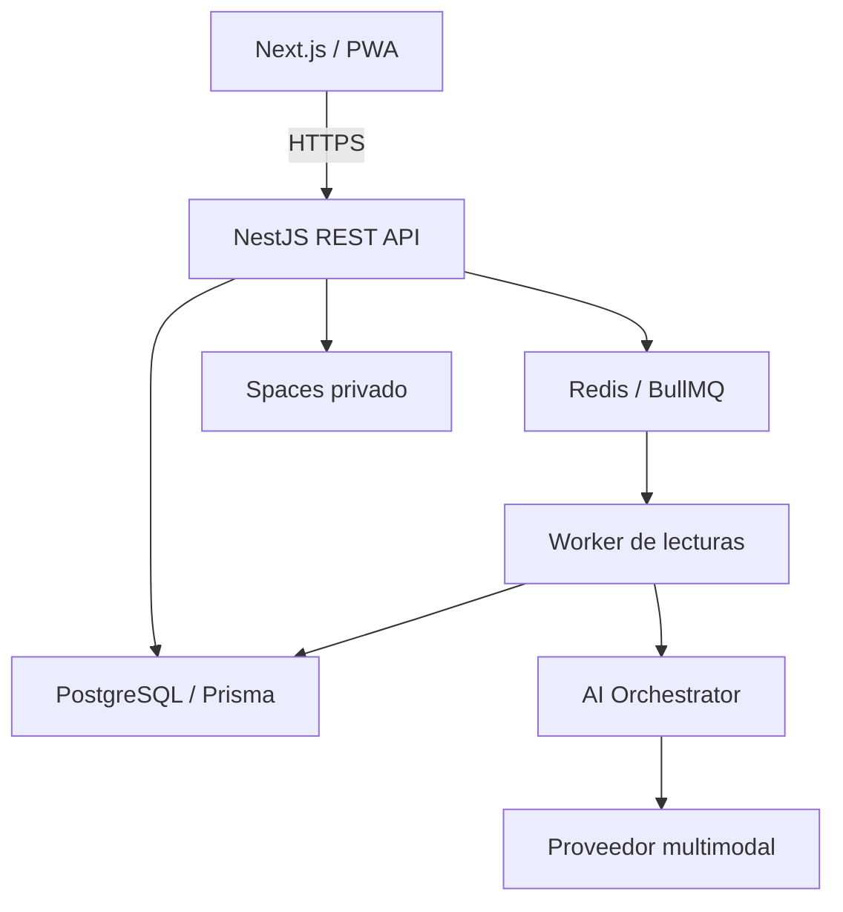
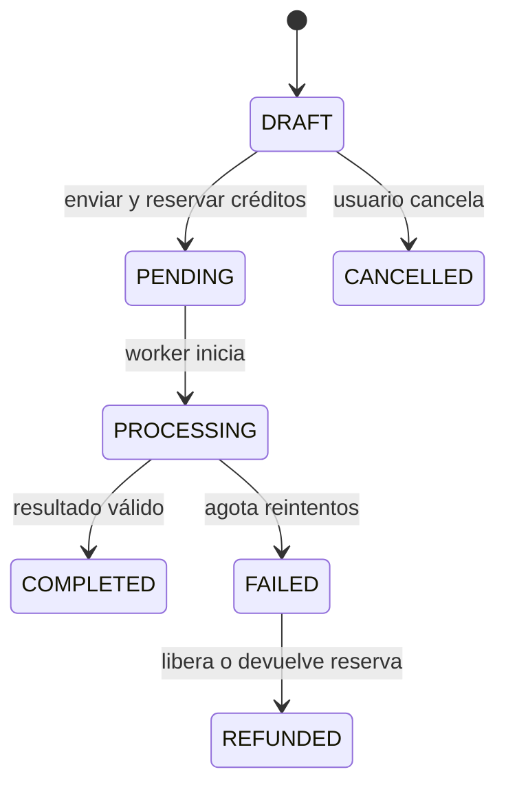

# Plan técnico y guía de construcción — MVP Plataforma de Lecturas con IA

> Documento maestro para construir el producto con Claude Code.
>
> Versión: 1.0  
> Fecha: 2026-09-02  
> Mercado inicial: Colombia, preparado para LATAM  
> Estado: listo para iniciar desarrollo

---

## 1. Instrucción principal para Claude Code

Claude debe tratar este documento como la fuente de verdad funcional y técnica del MVP.

Antes de modificar código:

1. Lee este archivo completo y revisa la estructura actual del repositorio.
2. Identifica la fase y las historias que se van a implementar.
3. Presenta un plan breve con archivos afectados, migraciones, endpoints, riesgos y pruebas.
4. No implementes funcionalidades de fases futuras salvo que sean una dependencia técnica indispensable.
5. Conserva el código existente y evita reescrituras masivas sin justificación.
6. Ejecuta lint, typecheck, pruebas y build antes de declarar una tarea terminada.
7. Actualiza la sección `Registro de avance` al terminar cada historia.
8. Si existe una ambigüedad que cambie el comportamiento, seguridad, dinero o modelo de datos, pregunta antes de asumir.

Prompt recomendado para iniciar una sesión:

```text
Lee PLAN_TECNICO_MVP_ORACULO_IA.md completo y úsalo como fuente de verdad.
Inspecciona el repositorio y dime:
1. estado actual frente al documento;
2. brechas encontradas;
3. propuesta para ejecutar la siguiente historia pendiente;
4. archivos que modificarías;
5. pruebas y criterios de aceptación.

No escribas código hasta presentar el plan. Después de mi aprobación, implementa una historia a la vez, verifica lint, typecheck, tests y build, y actualiza el registro de avance del documento.
```

---

## 2. Visión del producto

Construir una plataforma de experiencias espirituales digitales asistidas por IA. El producto no debe presentarse como una simple interfaz de “tarot con IA”, sino como el inicio de un **perfil espiritual digital** que personaliza futuras experiencias mediante el historial autorizado del usuario.

El MVP debe validar:

- Que el visitante se registre y complete una experiencia gratuita.
- Que una parte de los usuarios compre créditos.
- Que complete una lectura paga de tarot o manos.
- Que regrese y realice una segunda lectura.
- Que el costo de IA permita un margen bruto saludable.

### Alcance P0 del MVP

- Landing pública.
- Registro, inicio y cierre de sesión.
- Verificación y recuperación de contraseña.
- Carta diaria gratuita.
- Tarot de tres cartas.
- Lectura de manos mediante imágenes privadas.
- Procesamiento asíncrono con Redis y BullMQ.
- Motor de IA desacoplado y respuestas estructuradas.
- Prompts versionados y publicables desde administración.
- Wallet de créditos con ledger auditable.
- Compra de paquetes mediante Wompi.
- Historial de lecturas.
- Enlace e imagen resumida para compartir.
- Panel administrativo básico.
- Analítica de producto, costos de IA y errores.
- Privacidad, eliminación de imágenes y textos legales visibles.

### Fuera del MVP

- Marketplace de tarotistas humanos.
- Chat o videollamadas.
- Astrología avanzada, numerología, sueños, runas o compatibilidad.
- Suscripciones.
- WhatsApp, redes sociales o app móvil nativa.
- Microservicios, Kubernetes y multi-región.

---

## 3. Principios técnicos no negociables

1. El frontend nunca consume directamente un proveedor de IA.
2. Tarot, manos y servicios futuros usan un `Reading Engine` común.
3. La selección de cartas ocurre en backend; la IA solo interpreta.
4. Los resultados de IA se solicitan y validan como JSON estructurado.
5. Todo prompt publicado queda versionado; una versión usada nunca se sobrescribe.
6. Pagos, acreditación y consumo de créditos son idempotentes.
7. Todo movimiento de saldo genera una transacción en el ledger.
8. Una lectura no vuelve a cobrar por reintentos técnicos.
9. Las imágenes son privadas, se entregan con URL firmada y se eliminan automáticamente.
10. No se almacenan secretos en Git ni se exponen en el navegador o logs.
11. Dinero se maneja en unidades menores enteras; créditos como enteros.
12. Fechas se almacenan en UTC y se muestran en la zona horaria del usuario.
13. Acciones administrativas y financieras generan auditoría.
14. Ninguna lectura ofrece diagnósticos, certeza futura o asesoría profesional.

---

## 4. Stack tecnológico

| Capa | Tecnología |
|---|---|
| Web | Next.js, TypeScript, App Router |
| UI | Tailwind CSS, shadcn/ui |
| Estado servidor | TanStack Query |
| Formularios | React Hook Form + Zod |
| API | NestJS, TypeScript, REST |
| Validación API | class-validator o Zod, de forma consistente |
| ORM | Prisma |
| Base de datos | PostgreSQL |
| Caché y colas | Redis + BullMQ |
| IA | Gateway propio con adaptadores de proveedor |
| Archivos | DigitalOcean Spaces, bucket privado |
| Pagos | Wompi mediante adaptador |
| Infraestructura | DigitalOcean + Docker Compose |
| Proxy, TLS y DNS | Nginx + Cloudflare |
| Errores | Sentry |
| Analítica | PostHog; GA opcional para adquisición |
| CI/CD | GitHub Actions |
| Pruebas | Jest/Vitest + Supertest + Playwright |

Preferir dos repositorios independientes:

```text
oracle-api
oracle-web
```

Si el proyecto ya está creado como monorepo, conservarlo y separar claramente `apps/api`, `apps/web` y paquetes compartidos.

---

## 5. Arquitectura de ejecución



### Flujo de una lectura



El `POST /readings/:id/submit` debe responder rápidamente. El cliente consulta estado por polling con backoff; SSE puede agregarse después.

---

## 6. Estructura backend esperada

```text
src/
  auth/
  users/
  roles/
  services/
  readings/
    processors/
  tarot/
  palm-reading/
  ai/
    providers/
    orchestrator/
    schemas/
  prompts/
  credits/
  payments/
    providers/
  orders/
  storage/
  notifications/
  analytics/
  admin/
  audit/
  jobs/
  health/
  common/
  config/
  prisma/
```

Contratos principales:

```ts
export interface ReadingProcessor<TInput, TResult> {
  supports(serviceCode: string): boolean;
  validate(input: TInput): Promise<void>;
  process(context: ReadingContext<TInput>): Promise<TResult>;
}

export interface AIProvider {
  generateStructured<T>(request: AIRequest<T>): Promise<AIResponse<T>>;
  analyzeImage<T>(request: AIImageRequest<T>): Promise<AIResponse<T>>;
}

export interface PaymentProvider {
  createPayment(input: CreatePaymentInput): Promise<PaymentIntent>;
  verifyPayment(reference: string): Promise<PaymentVerification>;
  verifyWebhook(input: RawWebhookInput): Promise<VerifiedPaymentEvent>;
  refund(input: RefundInput): Promise<RefundResult>;
}
```

No se permite importar el SDK concreto de IA fuera de `ai/providers` ni el SDK de Wompi fuera de `payments/providers`.

---

## 7. Estructura frontend esperada

```text
src/
  app/
    (public)/
    (auth)/
      login/
      register/
      forgot-password/
    (app)/
      dashboard/
      tarot/
      hands/
      readings/
      wallet/
      profile/
    (admin)/
      admin/
  components/
  features/
  hooks/
  lib/
  services/
  schemas/
  types/
```

Rutas principales:

| Ruta | Propósito |
|---|---|
| `/` | Landing y propuesta de valor |
| `/register`, `/login` | Autenticación |
| `/dashboard` | Carta diaria, accesos, saldo e historial reciente |
| `/tarot` | Tirada y pregunta |
| `/hands` | Captura/subida guiada de palmas |
| `/readings` | Historial |
| `/readings/[id]` | Estado o resultado |
| `/wallet` | Saldo, movimientos y paquetes |
| `/r/[token]` | Resumen público compartible |
| `/admin/*` | Operación administrativa |

Requisitos UX:

- Mobile first y accesible por teclado.
- Estados vacíos, carga, error, reintento y éxito explícitos.
- El costo en créditos se muestra antes de confirmar.
- La animación de tarot acompaña el procesamiento, pero no simula un resultado ya terminado.
- La captura de manos guía iluminación, encuadre y privacidad.

---

## 8. Modelo de datos

### Entidades mínimas

```text
users
refresh_tokens
roles
user_roles
services
service_forms
readings
reading_inputs
reading_images
tarot_decks
tarot_cards
tarot_spreads
tarot_spread_positions
tarot_draws
prompts
prompt_versions
ai_executions
wallets
wallet_transactions
credit_reservations
credit_packages
orders
payments
webhook_events
coupons
coupon_redemptions
share_links
analytics_events
notifications
audit_logs
```

### Relaciones y restricciones clave

- `users.email` único y normalizado.
- Un `user` tiene una sola `wallet`.
- `services.code` es único, estable y no depende del nombre visible.
- Cada `reading` referencia el servicio y la versión exacta del prompt utilizado.
- Cada `tarot_draw` pertenece a una lectura y guarda posición, carta y orientación.
- Solo una versión publicada de prompt puede estar activa por `prompt.code` y ambiente.
- `wallet_transactions.idempotency_key` es única.
- `payments(provider, provider_reference)` es único.
- `webhook_events(provider, event_id)` es único.
- `share_links.token_hash` es único; almacenar hash cuando sea viable.
- Los importes se guardan como enteros en centavos de COP o la unidad menor aplicable.
- Usar `Decimal` únicamente para costos estimados de IA que requieran fracción.
- Índices en claves foráneas y consultas frecuentes: usuario/fecha, estado/fecha, provider/reference y prompt/version.

### Estados

```text
UserStatus: ACTIVE | BLOCKED | DELETED
ReadingStatus: DRAFT | PENDING | PROCESSING | COMPLETED | FAILED | REFUNDED | CANCELLED
AIExecutionStatus: PENDING | COMPLETED | FAILED
OrderStatus: PENDING | PAID | CANCELLED | REFUNDED
PaymentStatus: PENDING | APPROVED | DECLINED | FAILED | REFUNDED
WalletTransactionType: PURCHASE | RESERVATION | CONSUMPTION | RELEASE | REFUND | BONUS | PROMOTION | REFERRAL | ADJUSTMENT
ImageStatus: PENDING_UPLOAD | UPLOADED | VALID | INVALID | DELETED
PromptVersionStatus: DRAFT | PUBLISHED | ARCHIVED
```

### Regla de créditos

La fuente auditable es el ledger. Cualquier campo `wallet.balance` es una proyección actualizada dentro de la misma transacción de base de datos y debe poder reconciliarse con los movimientos.

Flujo:

1. Bloquear wallet o usar actualización atómica con control de concurrencia.
2. Verificar saldo disponible.
3. Crear reserva idempotente.
4. Procesar lectura.
5. Confirmar consumo si termina correctamente.
6. Liberar o reembolsar si falla definitivamente.

---

## 9. Catálogo y formularios dinámicos

Servicios iniciales:

| Código | Tipo | Créditos iniciales sugeridos |
|---|---|---:|
| `DAILY_CARD` | Carta diaria | 0 |
| `TAROT_THREE` | Tarot pasado/presente/tendencia | 10 |
| `PALM_BASIC` | Una palma | 15 |
| `PALM_COMPLETE` | Dos palmas | 25 |

Los valores deben ser configurables; son hipótesis comerciales, no constantes del código.

Cada servicio contiene `formSchema` versionado. El backend vuelve a validar todos los campos aunque el frontend haya usado el mismo esquema.

Ejemplo conceptual:

```json
{
  "version": 1,
  "fields": [
    {
      "key": "question",
      "type": "textarea",
      "label": "¿Qué quieres consultar?",
      "required": true,
      "minLength": 5,
      "maxLength": 500
    },
    {
      "key": "topic",
      "type": "select",
      "required": true,
      "options": ["LOVE", "WORK", "MONEY", "PERSONAL"]
    }
  ]
}
```

---

## 10. Tarot

### Datos del dominio

- Mazo inicial de 78 cartas.
- Arcanos mayores y menores.
- Significados normalizados para posición derecha e invertida.
- Tirada inicial: pasado, presente y tendencia; evitar afirmar un futuro cierto.

### Selección segura

La API selecciona las cartas usando aleatoriedad criptográficamente segura del runtime. La IA no selecciona ni cambia cartas.

Guardar antes de procesar:

```json
[
  {"position":"PAST","cardCode":"THE_MOON","orientation":"UPRIGHT"},
  {"position":"PRESENT","cardCode":"THE_LOVERS","orientation":"UPRIGHT"},
  {"position":"TREND","cardCode":"THE_WORLD","orientation":"REVERSED"}
]
```

### Resultado estructurado mínimo

```json
{
  "title": "string",
  "summary": "string",
  "cards": [
    {
      "position": "PAST",
      "cardCode": "THE_MOON",
      "interpretation": "string"
    }
  ],
  "insights": ["string"],
  "suggestedActions": ["string"],
  "closingReflection": "string",
  "disclaimer": "string"
}
```

---

## 11. Lectura de manos

### Flujo

1. Crear lectura en `DRAFT`.
2. Solicitar URL firmada de carga con tipo, tamaño y clave controlados por backend.
3. Cliente carga directamente al bucket privado.
4. API confirma objeto y registra metadatos.
5. Validación preliminar determina si es una palma legible.
6. Solo imágenes válidas permiten enviar la lectura.
7. Worker procesa con modelo multimodal y valida la salida.
8. Se programa eliminación del archivo, por defecto en 24 horas.

Validaciones:

- MIME real permitido: JPEG, PNG o WebP.
- Tamaño máximo configurable, inicialmente 10 MB.
- Dimensiones mínimas configurables.
- Una palma visible, completa, iluminada y enfocada.
- Rechazar archivos ejecutables, SVG y formatos no permitidos.
- El nombre físico se genera en servidor; nunca usar directamente el nombre recibido.

Resultado:

```json
{
  "title": "string",
  "summary": "string",
  "observations": {
    "heartLine": "string",
    "headLine": "string",
    "lifeLine": "string",
    "generalShape": "string"
  },
  "strengths": ["string"],
  "growthAreas": ["string"],
  "reflection": "string",
  "disclaimer": "string"
}
```

No se deben inferir identidad, salud, etnia, discapacidad, edad exacta u otros atributos sensibles desde la imagen.

---

## 12. Motor de IA y prompts

La aplicación invoca el motor así:

```ts
await aiOrchestrator.execute({
  task: 'TAROT_THREE_INTERPRETATION',
  readingId,
  input,
  schema: tarotResultSchema,
});
```

El orquestador decide:

- proveedor y modelo;
- prompt publicado;
- parámetros permitidos;
- esquema de salida;
- timeout;
- reintentos técnicos;
- fallback autorizado;
- registro de tokens, costo y latencia.

### Versionamiento

- `prompts` identifica la tarea estable.
- `prompt_versions` almacena contenido, modelo, parámetros, esquema, autor y fecha.
- Publicar crea o activa una versión inmutable.
- Una lectura registra `promptVersionId` y modelo real.
- Nunca guardar secretos o datos personales en prompts de prueba.

### Guardrails

Pipeline obligatorio:

```text
validación de entrada
→ clasificación de riesgo
→ minimización de datos
→ procesamiento IA
→ validación de esquema
→ revisión de contenido
→ persistencia
```

La respuesta debe reconducirse o bloquearse si pretende:

- diagnosticar condiciones médicas o psicológicas;
- ordenar suspender tratamientos;
- brindar asesoría legal o financiera personalizada;
- asegurar muerte, embarazo, enfermedad, delito o acontecimientos futuros;
- fomentar autolesión, violencia, dependencia o explotación;
- presentar la lectura como verdad verificable.

Texto base visible:

> Las lecturas tienen fines de entretenimiento, reflexión y orientación personal. No constituyen asesoramiento médico, psicológico, jurídico, financiero ni profesional, ni garantizan acontecimientos futuros.

---

## 13. Colas y trabajos

Colas iniciales:

| Cola | Jobs |
|---|---|
| `reading-processing` | `PROCESS_TAROT`, `PROCESS_PALM` |
| `image-analysis` | `VALIDATE_PALM_IMAGE` |
| `notifications` | `READING_COMPLETED`, `PAYMENT_CONFIRMED` |
| `media` | `GENERATE_SHARE_IMAGE` |
| `cleanup` | `DELETE_EXPIRED_IMAGES`, `PURGE_EXPIRED_TOKENS` |

Configuración base de jobs de IA:

- Tres intentos totales.
- Backoff exponencial.
- Timeout explícito.
- `jobId` determinista por lectura y tipo de operación.
- Procesador idempotente: si la lectura ya está completada, no vuelve a ejecutar ni cobrar.
- Dead-letter o registro operativo de fallos agotados.
- Límites de concurrencia por proveedor para controlar costo y rate limits.

---

## 14. API REST del MVP

Prefijo: `/api/v1`.

### Autenticación y usuario

```http
POST /auth/register
POST /auth/login
POST /auth/refresh
POST /auth/logout
POST /auth/forgot-password
POST /auth/reset-password
POST /auth/verify-email
GET  /auth/me
PATCH /users/me
DELETE /users/me
```

### Servicios y carta diaria

```http
GET /services
GET /services/:code
GET /daily-card
```

### Lecturas

```http
POST   /readings
GET    /readings
GET    /readings/:id
PATCH  /readings/:id/inputs
POST   /readings/:id/images/presign
POST   /readings/:id/images/confirm
POST   /readings/:id/submit
POST   /readings/:id/retry
DELETE /readings/:id
POST   /readings/:id/share
DELETE /readings/:id/share
```

Reglas de acceso:

- Un usuario solo ve y modifica sus recursos.
- Una lectura enviada ya no permite cambiar entradas.
- `retry` no debe crear otro cobro y solo aplica a estados autorizados.
- Un enlace compartido expone un resumen saneado, nunca imágenes ni contexto privado.

### Wallet, órdenes y pagos

```http
GET  /wallet
GET  /wallet/transactions
GET  /credit-packages
POST /orders
GET  /orders/:id
POST /payments/wompi
POST /webhooks/wompi
```

El endpoint de webhook usa el cuerpo crudo cuando la validación de firma lo requiera. Nunca se acredita saldo basándose en la redirección del navegador.

### Administración

```http
GET/PATCH       /admin/services
GET/POST/PATCH  /admin/prompts
POST            /admin/prompts/:id/test
POST            /admin/prompts/:id/publish
GET              /admin/users
GET              /admin/readings
GET              /admin/orders
GET              /admin/payments
GET              /admin/ai-executions
GET              /admin/metrics
POST             /admin/wallet-adjustments
```

Las operaciones mutables administrativas requieren rol, motivo y audit log.

---

## 15. Pagos con Wompi

Flujo:

1. Usuario selecciona paquete.
2. Backend crea una orden con precio congelado, moneda y créditos.
3. Backend crea la intención o referencia de pago.
4. Usuario paga mediante el mecanismo aprobado de Wompi.
5. Wompi envía webhook.
6. Backend valida firma, referencia, moneda, monto y estado.
7. En una transacción, marca pago/orden y acredita créditos una sola vez.
8. Webhooks repetidos retornan éxito sin duplicar efectos.

No almacenar datos completos de tarjeta. Persistir solo información necesaria del proveedor, referencias y payload saneado.

---

## 16. Carta diaria y caché

La carta diaria puede ser determinista por usuario y fecha mediante HMAC con un secreto del servidor, evitando cambios durante el día sin hacerla predecible externamente.

Cachear:

```text
services:list
tarot:deck:{id}
prompt:published:{code}
daily-card:interpretation:{cardCode}:{locale}:{version}
```

No cachear resultados personales para compartirlos entre usuarios. Pre-generar interpretaciones generales de las 78 cartas para reducir el costo recurrente.

---

## 17. Seguridad, privacidad y cumplimiento

Mínimos técnicos:

- Helmet y política CSP compatible con los proveedores usados.
- CORS por allowlist.
- Rate limiting global y específico para auth, cargas e IA.
- Argon2id para contraseñas.
- Refresh tokens rotatorios almacenados con hash.
- Cookies `HttpOnly`, `Secure` y `SameSite` cuando aplique.
- Validación y transformación estricta de DTO.
- Protección contra mass assignment.
- Secretos mediante variables/secret store.
- URL firmadas de corta duración.
- Cifrado TLS en tránsito y cifrado del proveedor en reposo.
- Logs estructurados sin contraseñas, tokens, preguntas completas o URL firmadas.
- Auditoría de accesos administrativos y ajustes de saldo.
- Backups automáticos y prueba periódica de restauración.
- Dependencias escaneadas en CI.

Rate limits iniciales, ajustables:

| Operación | Límite sugerido |
|---|---:|
| Login/registro | 5 por minuto/IP |
| Recuperar contraseña | 3 por hora/email e IP |
| Carta diaria | 20 por minuto/usuario |
| Crear/enviar lectura | 10 por minuto/usuario |
| Presign de imágenes | 10 por hora/usuario |
| Webhook | límite alto + firma + idempotencia |

Privacidad:

- Consentimiento explícito antes de procesar imágenes.
- Retención configurable; imágenes de palmas se borran por defecto en 24 horas.
- Permitir eliminar lectura y cuenta conforme a la política aplicable.
- Separar consentimiento de términos, privacidad y comunicaciones comerciales.
- Definir encargado/responsable, finalidades y canal para consultas/reclamos.
- No usar datos o imágenes para entrenamiento sin autorización separada y explícita.

Antes del lanzamiento en Colombia deben estar publicados y revisados jurídicamente:

- Términos y condiciones.
- Política de privacidad.
- Política de tratamiento de datos personales.
- Canal de PQR.
- Identificación de la empresa y NIT.
- Descripción de servicios, precios totales, tiempos y condiciones.
- Política de retracto, reversión y devoluciones cuando corresponda.
- Descargo de responsabilidad de entretenimiento.

Este documento no reemplaza asesoría jurídica.

---

## 18. Observabilidad y analítica

Cada request debe tener `requestId`; propagar `readingId`, `jobId`, `orderId` o `paymentId` cuando aplique.

Registrar en `AIExecution`:

- proveedor y modelo real;
- prompt y versión;
- tokens de entrada/salida;
- costo estimado y moneda;
- latencia;
- intento;
- estado y error normalizado;
- lectura asociada.

Eventos de producto:

```text
LANDING_VIEWED
SIGN_UP_COMPLETED
EMAIL_VERIFIED
DAILY_CARD_VIEWED
READING_DRAFT_CREATED
READING_SUBMITTED
READING_COMPLETED
READING_FAILED
CHECKOUT_STARTED
PAYMENT_COMPLETED
CREDITS_PURCHASED
READING_SHARED
SECOND_READING_COMPLETED
```

No enviar texto libre sensible a herramientas de analítica. Usar IDs seudónimos y propiedades controladas.

KPIs iniciales:

| KPI | Hipótesis de validación |
|---|---:|
| Registro/visita | > 10% |
| Carta diaria/registro | > 50% |
| Pago/usuario registrado | > 3–5% |
| Pago tras experiencia gratuita | > 5% |
| Repetición a 30 días | > 15% |
| Error técnico de lecturas | < 2% |
| Fallo definitivo de IA | < 1% |
| Margen bruto estimado | > 70% |

Son objetivos de experimentación, no garantías.

---

## 19. Infraestructura y ambientes

Ambientes separados:

```text
local
staging
production
```

MVP productivo:

- Cloudflare para DNS, TLS y protección básica.
- Nginx como reverse proxy.
- Contenedores separados para web, API y worker.
- PostgreSQL administrado preferiblemente; Docker solo en validación temprana controlada.
- Redis administrado o contenedor con persistencia y límites explícitos.
- Spaces privado para imágenes.
- Backups, monitoreo y alertas.

```text
web
api
worker
postgres
redis
nginx
```

Nunca desplegar worker y API como un único proceso aunque puedan compartir imagen de aplicación. Esto permite escalar workers de manera independiente.

Variables esperadas, sin valores reales:

```dotenv
NODE_ENV=
DATABASE_URL=
REDIS_URL=
JWT_ACCESS_SECRET=
JWT_REFRESH_SECRET=
AI_PROVIDER=
AI_API_KEY=
SPACES_ENDPOINT=
SPACES_BUCKET=
SPACES_ACCESS_KEY=
SPACES_SECRET_KEY=
WOMPI_PUBLIC_KEY=
WOMPI_PRIVATE_KEY=
WOMPI_EVENTS_SECRET=
SENTRY_DSN=
POSTHOG_KEY=
APP_URL=
API_URL=
```

Mantener `.env.example` sin secretos.

---

## 20. Estrategia de pruebas

### Unitarias

- Selección de cartas sin duplicados y orientación válida.
- Selección del procesador correcto.
- Construcción y renderizado de prompts.
- Validación de respuestas estructuradas.
- Cálculo/reserva/consumo/liberación de créditos.
- Verificación de firma y mapeo de estados de pago.
- Redacción de datos sensibles en logs.

### Integración

- Auth con rotación/revocación de refresh tokens.
- Prisma con PostgreSQL real de pruebas.
- Creación y envío de lectura.
- Worker con proveedor IA simulado.
- Concurrencia en wallet: nunca saldo negativo ni doble consumo.
- Webhook repetido: una sola acreditación.
- Caducidad y eliminación de imágenes.

### E2E

```text
registro → verificación → carta diaria
registro → créditos bonus → tarot → resultado → historial
sin saldo → checkout → webhook aprobado → saldo → lectura
subida de palma inválida → corrección → procesamiento → resultado
lectura completada → enlace público resumido
```

### Fallos a probar

- Timeout y rate limit del proveedor IA.
- JSON inválido del modelo.
- Redis temporalmente no disponible.
- Doble clic en enviar lectura.
- Tres webhooks iguales y webhooks fuera de orden.
- Imagen inexistente, corrupta o con MIME falso.
- Crédito insuficiente y dos compras concurrentes.

---

## 21. CI/CD y calidad

Pull request obligatorio:

```text
install reproducible
lint
typecheck
unit tests
integration tests
build
prisma validate
migration check
dependency/security scan
```

Despliegue:

1. Crear backup cuando corresponda.
2. Ejecutar migraciones compatibles hacia adelante.
3. Desplegar API y worker.
4. Desplegar web.
5. Validar health/readiness y smoke test.
6. Tener procedimiento documentado de rollback.

No usar `prisma db push` en producción. Las migraciones destructivas requieren estrategia en etapas y respaldo.

---

## 22. Roadmap de implementación

Cada historia debe caber idealmente en un PR revisable. No iniciar la fase siguiente con defectos críticos abiertos.

### Fase 0 — Fundación

- [x] Inicializar repositorios y convenciones.
- [x] Docker Compose local con PostgreSQL y Redis.
- [x] Configuración tipada por ambiente.
- [x] Prisma y primera migración.
- [x] Health, readiness y logging estructurado.
- [x] CI con lint, typecheck, test y build.
- [ ] Staging desplegable.

**Salida:** `/api/v1/health` responde correctamente y web/API/worker se despliegan de forma reproducible.

### Fase 1 — Autenticación y usuarios

- [x] Registro y login.
- [x] Access y refresh token rotatorio.
- [x] Logout/revocación.
- [x] Verificación de correo.
- [x] Recuperación de contraseña.
- [x] Perfil y roles `USER`, `ADMIN`.
- [x] Protección de rutas web y API.

**Salida:** usuario puede completar el ciclo de autenticación y un usuario normal no accede a administración.

### Fase 2 — Servicios y carta diaria

- [x] Catálogo y formularios dinámicos.
- [x] CRUD administrativo de servicios.
- [x] Seed de 78 cartas.
- [x] Carta diaria determinista y cacheada.
- [x] Dashboard inicial.

**Salida:** usuario ve la misma carta durante su día y el administrador configura disponibilidad/costo.

### Fase 3 — Motor de tarot

- [x] Mazos, cartas, tiradas y posiciones.
- [x] Draw engine seguro y probado.
- [x] Creación de lectura `DRAFT`.
- [x] Entradas y envío.
- [x] Vista de preparación/animación.

**Salida:** backend crea y persiste una tirada completa sin IA.

### Fase 4 — Motor de IA

- [x] Contrato `AIProvider`.
- [x] Primer proveedor.
- [x] Orquestador, timeouts y errores.
- [x] Prompts/versiones/publicación.
- [x] Salida JSON validada.
- [x] Registro `AIExecution`.
- [x] Guardrails de entrada y salida.
- [x] Playground administrativo sin datos reales.

**Salida:** una tirada se convierte en lectura estructurada y auditable.

### Fase 5 — Reading Engine y BullMQ

- [x] Contrato `ReadingProcessor`.
- [x] `TarotReadingProcessor`.
- [x] Colas, workers y reintentos.
- [x] Idempotencia y recuperación de fallos.
- [x] Polling de estado en frontend.
- [x] Historial y resultado.

**Salida:** el request no espera a la IA y el proceso sobrevive fallos temporales.

### Fase 6 — Lectura de manos

- [x] Bucket privado y URL firmada.
- [x] Confirmación segura de carga.
- [x] Validación técnica y visual.
- [x] `PalmReadingProcessor` multimodal.
- [x] Resultado estructurado.
- [x] Job de eliminación y evidencia de borrado.

**Salida:** el usuario corrige imágenes inválidas y las válidas generan un reporte; las imágenes expiran.

### Fase 7 — Wallet y créditos

- [x] Wallet y ledger.
- [x] Bonus inicial configurable.
- [x] Reserva, consumo, liberación y reembolso.
- [x] Pruebas de concurrencia e idempotencia.
- [x] Saldo y movimientos en frontend.

**Salida:** ninguna concurrencia produce saldo negativo, doble cobro o movimiento sin trazabilidad.

### Fase 8 — Órdenes y pagos

- [x] Paquetes de créditos.
- [x] Órdenes con precio congelado.
- [x] Adaptador Wompi (credenciales reales de sandbox pendientes del usuario).
- [x] Webhook firmado e idempotente.
- [x] Acreditación transaccional.
- [x] Estados de checkout y conciliación básica.

**Salida:** un pago aprobado acredita exactamente una vez, incluso con webhooks repetidos.

### Fase 9 — Compartir y crecimiento

- [x] Token público revocable.
- [x] Resumen saneado.
- [x] Imagen vertical 1080 × 1920.
- [x] CTA y atribución de adquisición.
- [x] Eventos de compartir y conversión.

**Salida:** compartir nunca revela pregunta, imágenes o lectura completa.

### Fase 10 — Administración, métricas y lanzamiento

- [x] Dashboard de usuarios, lecturas, ventas, conversión, IA y margen.
- [x] Consulta de errores y reintentos controlados.
- [x] Audit logs y ajustes manuales con motivo.
- [x] Sentry y alertas (SDK integrado y verificado; activo cuando exista un DSN real, ver `LAUNCH_CHECKLIST.md`).
- [x] Políticas y textos legales visibles (borrador, pendiente de revisión legal real).
- [x] Pruebas E2E, carga básica, backup y restauración.
- [x] Checklist de seguridad y lanzamiento (`LAUNCH_CHECKLIST.md`).

**Salida:** recorrido completo funciona en producción sin intervención manual.

---

## 23. Definition of Done por historia

Una historia solo se marca terminada cuando:

- Cumple todos sus criterios de aceptación.
- Valida autorización, errores y casos límite.
- Incluye migración y seed cuando corresponda.
- Tiene pruebas unitarias y/o integración proporcionales al riesgo.
- No introduce errores de lint o TypeScript.
- API y frontend construyen correctamente.
- Documentación/OpenAPI se actualiza.
- No expone secretos ni datos personales en logs.
- Incluye observabilidad mínima.
- Fue comprobada en interfaz cuando tiene impacto visual.
- El registro de avance de este archivo fue actualizado.

### Definition of Done del MVP

Debe funcionar, sin intervención manual:

```text
visita
→ registro y verificación
→ carta diaria
→ compra o bonus de créditos
→ creación de lectura
→ reserva de créditos
→ procesamiento asíncrono
→ resultado validado
→ consumo definitivo
→ historial
→ compartir resumen
```

Además:

- Pago repetido no duplica créditos.
- Retry no duplica cobro.
- Fallo definitivo devuelve/libera créditos.
- Usuario no accede a recursos ajenos.
- Imágenes se eliminan según retención.
- Administrador ve ingreso, costo estimado de IA y fallos.
- Backup y restauración fueron probados.

---

## 24. Primer backlog listo para ejecutar

### US-0001 — Bootstrap de API

**Como** equipo de desarrollo, **quiero** una API NestJS configurada y verificable **para** construir módulos de forma segura.

Criterios:

- Configuración tipada falla al iniciar si falta una variable requerida.
- `GET /api/v1/health` retorna versión, ambiente y estado básico sin filtrar secretos.
- Logging incluye `requestId`.
- Swagger/OpenAPI funciona solo en ambientes autorizados.
- Lint, typecheck, test y build pasan.

### US-0002 — PostgreSQL y Prisma

**Como** equipo, **quiero** persistencia migrable **para** mantener datos consistentes.

Criterios:

- PostgreSQL inicia localmente mediante Docker Compose.
- Prisma usa migraciones, no sincronización automática.
- Primera migración incluye `User`, timestamps y enums base.
- Existe script de seed idempotente.
- Prueba de integración usa una base aislada.

### US-0003 — Redis y worker

**Como** plataforma, **quiero** ejecutar trabajos fuera del request web **para** soportar tareas lentas.

Criterios:

- Redis inicia localmente.
- API encola un job de prueba.
- Worker separado lo procesa de manera idempotente.
- Hay health/readiness y cierre ordenado.
- Un fallo temporal demuestra reintento y backoff.

### US-0004 — Web base

**Como** usuario, **quiero** una interfaz responsive **para** navegar desde móvil o escritorio.

Criterios:

- Next.js App Router con layout público, auth, app y admin.
- Tema visual inicial, componentes base y estados de feedback.
- Cliente API centralizado con manejo de error tipado.
- Accesibilidad básica y diseño mobile first.
- Lint, typecheck, test y build pasan.

### US-0005 — CI y entorno local

**Como** equipo, **quiero** validación automática **para** evitar regresiones.

Criterios:

- README contiene requisitos, instalación y comandos.
- `.env.example` está completo y sin secretos.
- Un comando inicia dependencias locales.
- CI ejecuta validaciones en cada pull request.
- No se versionan archivos generados, claves o `.env` reales.

---

## 25. Registro de decisiones técnicas

Usar este formato y no borrar decisiones anteriores:

| ID | Fecha | Decisión | Motivo | Consecuencias |
|---|---|---|---|---|
| ADR-001 | 2026-09-02 | API y web independientes; worker como proceso separado | Despliegue y escalado independientes | Más de un artefacto de despliegue |
| ADR-002 | 2026-09-02 | Reading Engine + estrategias | Agregar servicios sin condicionales crecientes | Requiere contratos estables |
| ADR-003 | 2026-09-02 | Ledger + reserva de créditos | Trazabilidad e idempotencia financiera | Mayor disciplina transaccional |
| ADR-004 | 2026-09-02 | Salidas IA estructuradas | Validación, UI multicanal y seguridad | Se deben mantener schemas versionados |
| ADR-005 | 2026-09-02 | Imágenes privadas con eliminación en 24 horas | Minimización de datos sensibles | Jobs de limpieza y monitoreo |

---

## 26. Registro de avance

Claude debe actualizar esta tabla al terminar cada historia.

| Historia | Estado | PR/commit | Pruebas ejecutadas | Notas |
|---|---|---|---|---|
| US-0001 | Terminada | pendiente de commit | lint, typecheck, unit (7), e2e (2), build, smoke manual `/health` y `/docs` | Config tipada con Zod (fail-fast), `/api/v1/health`, logging estructurado (pino) con requestId, Helmet, ValidationPipe global, Swagger solo fuera de producción, prefijo global `api/v1` |
| US-0002 | Terminada | pendiente de commit | typecheck, lint, unit (9), e2e (2), integration (3) con DB aislada, build, smoke manual | `docker-compose.yml` (Postgres 16), migración `init` (User + UserStatus), seed idempotente, PrismaModule/Service con adapter `@prisma/adapter-pg` (Prisma 7 ya no acepta `datasource.url` en el schema, requiere `prisma.config.ts` + driver adapter), `DATABASE_URL`/`DATABASE_URL_TEST` ahora obligatorias/validadas. Se encontraron y limpiaron contenedores/volúmenes Docker huérfanos de una sesión previa sin código asociado (confirmado con el usuario antes de borrar) |
| US-0003 | Terminada | pendiente de commit | typecheck, lint, unit (11), e2e (2), integration (6: incluye cola aislada), build, smoke manual con API+worker como procesos separados reales | Redis en `docker-compose.yml`; `QueuesModule` (BullMQ) con cola `diagnostics`; `worker.ts`/`WorkerModule` como entrypoint separado (`dist/worker.js`, nunca corre junto a la API); `DiagnosticsController` (productor, en la API) y `DiagnosticsProcessor` (consumidor, solo en el worker); idempotencia por `jobId` determinista y retry con backoff verificados con Redis real; `app.enableShutdownHooks()` en API y worker. Se bajó `@nestjs/bullmq` de v12 (ESM-only, incompatible con el build CommonJS del proyecto) a v11.0.5 (CJS, compatible con Nest 10) |
| US-0004 | Terminada | pendiente de commit (repo `oracle-web` independiente) | lint, typecheck, 8 unit tests, build, smoke manual de rutas clave | `oracle-web` creado como repo Git hermano (Next.js 16 App Router, TS, Tailwind v4, shadcn/ui, TanStack Query, React Hook Form + Zod). Grupos de rutas (public)/(auth)/(app)/(admin) + `/r/[token]`, tema inicial, componentes base de feedback (empty/loading/error/success), cliente API tipado (`lib/api-client.ts`), accesibilidad básica (skip-link, `lang=es`, landmarks). Formularios de auth con validación real pero sin conectar al backend (Fase 1 aún no expone `/auth/*`) |
| US-0005 | Terminada | pendiente de commit (ambos repos) | oracle-api: typecheck, lint, build, 11 unit + 2 e2e + 6 integración. oracle-web: typecheck, lint, build, 8 unit | READMEs completos con requisitos/instalación/comandos en ambos repos; `.env.example` completos y sin secretos; `npm run docker:up` levanta las dependencias locales de `oracle-api` con un comando; `.github/workflows/ci.yml` en ambos repos (install reproducible, lint, typecheck, pruebas, build; `oracle-api` además valida el schema de Prisma, aplica migraciones y crea la base de datos aislada para integración; el scan de vulnerabilidades corre informativo/no bloqueante por deuda preexistente del scaffold de Nest). Los workflows no se han ejecutado en GitHub todavía porque ninguno de los dos repos tiene remoto configurado |

| US-0101 | Terminada | pendiente de commit | typecheck, lint, unit (11), e2e (2), integration (10: incluye 4 nuevas del modelo auth), build | Fase 1 desglosada en US-0101..US-0107 (no estaban numeradas en el backlog original). Modelo de datos: `Role`, `UserRole` (tabla puente), `RefreshToken` (hash único, `replacedBy` para detectar reuso en rotación), `User.emailVerifiedAt`. Migración `auth_roles_refresh_tokens`. Seed separa catálogo (`roles`, se siembra en todo ambiente) de fixtures de desarrollo (usuario demo, solo `NODE_ENV=local`). Decisiones confirmadas con el usuario: tokens como cookies httpOnly (access y refresh), y verificación/recuperación de correo con interfaz `NotificationsProvider` desacoplada que solo loggea en local/test (el plan no define proveedor de correo) |

| US-0102 | Terminada | pendiente de commit | typecheck, lint, unit (21: +10 de AuthService), e2e (2), integration (16: +6 de flujo de auth real con cookies), build, smoke manual con curl (register/login/me, cookies HttpOnly reales) | `POST /auth/register`, `POST /auth/login`, `GET /auth/me`. Argon2id vía `@node-rs/argon2` (el paquete `argon2` requiere compilar un binario nativo y esta máquina no tiene Visual Studio Build Tools; `@node-rs/argon2` trae binarios precompilados). Access token (15m) + refresh token (30d) como JWT firmados, ambos en cookies httpOnly/SameSite=Lax (Secure en producción); refresh token con path acotado a `/api/v1/auth`. Refresh token se guarda hasheado (SHA-256) en `refresh_tokens`. Rate limiting 5/min en register y login (`@nestjs/throttler`). CORS habilitado con `credentials: true` contra `APP_URL` (ahora obligatoria). Mensaje de error genérico en login para no filtrar si el correo existe. Se agregó `User.name` (migración nueva). **Bug real encontrado y corregido**: faltaba `esModuleInterop` en `tsconfig.json` — sin él, `cookie-parser` compilaba a `undefined` en runtime y habría tumbado la API en producción; también se bajó `@nestjs/jwt` de v12 (ESM-only) a v11.0.2 (mismo problema que BullMQ en US-0003) |

| US-0103 | Terminada | pendiente de commit | typecheck, lint, unit (28: +7 de refresh/logout), integration (21: +5 de rotación/reuso/logout reales), e2e (2), build, smoke manual con curl (rotación, reuso, logout) | `POST /auth/refresh` (rotación atómica vía `$transaction`: revoca el token viejo con `replacedBy` apuntando al nuevo) y `POST /auth/logout` (revoca, idempotente sin cookie). Detección de reuso: si se presenta un refresh token ya revocado, se revoca toda la familia de sesiones del usuario (protección estándar contra robo de tokens). **Bug real encontrado y corregido**: dos refresh tokens firmados dentro del mismo segundo eran JWT *idénticos* (firma determinista con mismo `iat`/`exp`), violando el unique constraint de `tokenHash` — se agregó un `jti` aleatorio al payload del refresh token |

| US-0104 | Terminada | pendiente de commit | typecheck, lint, unit (35: +7), integration (24: +3 de verificación real), e2e (2), build, smoke manual con curl viendo el log del stub de correo | `POST /auth/verify-email`. Migración `verification_tokens` (tabla reutilizable con `purpose`, para servir también a US-0105/recuperación de contraseña). `NotificationsProvider` desacoplado (`src/notifications/`) con `ConsoleNotificationsProvider` como única implementación por ahora — en local/test loggea, en staging/production loggea como `warn` dejando explícito que no hay proveedor real conectado (decisión confirmada con el usuario). El envío se dispara automáticamente al registrar; un fallo de envío no revierte el registro. Token opaco de un solo uso (32 bytes aleatorios, hash SHA-256 igual que refresh tokens), expira en 24h |

| US-0105 | Terminada | pendiente de commit | typecheck, lint, unit (44: +9), integration (28: +4 reales), e2e (2), build, smoke manual con curl (reset real, login viejo falla, login nuevo funciona) | `POST /auth/forgot-password` (reutiliza `verification_tokens` con `purpose=PASSWORD_RESET`, expira en 1h, nunca revela si el correo existe) y `POST /auth/reset-password` (cambia el hash, revoca **todos** los refresh tokens activos del usuario — cierre de sesión global tras cambio de contraseña, práctica estándar de seguridad). Rate limit 3/hora combinado por IP **y** correo (`getTracker` custom en `@Throttle`), tal como lo pide la sección 17 del plan |

| US-0106 | Terminada | pendiente de commit | typecheck, lint, unit (48: +4 de RolesGuard), integration (34: +6 de perfil/borrado/admin), e2e (2), build, smoke manual con curl (403→200 tras promover a ADMIN) | `PATCH/DELETE /users/me` y `GET /admin/users` (paginado, solo `ADMIN`). `RolesGuard` + `@Roles()` reutilizables para futuras rutas admin (Fase 10). Borrado de cuenta es soft-delete (`status=DELETED`) y revoca todas las sesiones. **Bug real encontrado y corregido**: `AuthModule` exportaba `JwtAuthGuard` pero no el `JwtModule` del que depende — `AdminModule`/`UsersModule` no podían resolver `JwtService` al importar el guard (error real de Nest DI, no cosmético de test). Además se resolvió una dependencia circular genuina Auth↔Users con `forwardRef()` (Auth necesita `UsersService`; Users necesita `JwtAuthGuard` para proteger `/users/me`) |

| US-0107 | Terminada | pendiente de commit (repo `oracle-web`) | typecheck, lint, 14 unit (oracle-web), build (16 rutas), verificación real en navegador con Playwright (registro→dashboard→logout→bloqueo→re-login) | Formularios de login/registro/forgot-password conectados al backend real (ya no simulados); páginas nuevas `/reset-password` y `/verify-email`; `useSession`/`useLogout` (TanStack Query) + `UserMenu` en el layout de `(app)`; `proxy.ts` (Next 16 renombró `middleware.ts` a `proxy.ts`, migrado) protege rutas `(app)`/`(admin)` por presencia de cookie; página admin con gate de rol client-side (autorización real la sigue haciendo el backend). Puerto de dev/start fijado a 3001 para calzar con el CORS del backend. **Verificado con Playwright real (no solo curl)**, instalado de forma efímera vía `npx` sin tocar el `package.json` del proyecto. Hallazgo menor no bloqueante: al hacer logout, un prefetch de Next en vuelo hacia una ruta protegida puede generar un 404 de red visible en consola (Next oculta a propósito los headers de RSC/prefetch dentro de Proxy para no poder diferenciarlos de una navegación real, así que no hay forma "oficial" de suprimirlo sin comprometer la protección) — no afecta la funcionalidad real, queda documentado para revisar si molesta en producción |

| US-0201 | Terminada | pendiente de commit | typecheck, lint, unit (57: +9 de ServicesService), integration (39: +6), e2e (2), build, smoke manual con curl (catálogo, admin, invalidación de caché real) | Migración `services_catalog` (`services`, `service_forms` versionado). `GET /services`, `GET /services/:code` públicos con caché Redis (`services:list`, 5 min TTL); `GET/PATCH /admin/services`, `POST /admin/services/:id/forms` (solo ADMIN). Seed idempotente de los 4 servicios base (secc. 9) + form v1 de `TAROT_THREE`. `CacheService` genérico nuevo (`src/cache/`) sobre ioredis, reutilizable para lo que sigue (carta diaria, mazo de tarot). Verificado con integración real que el PATCH invalida el caché inmediatamente (no queda data vieja servida) |

| US-0202 | Terminada | pendiente de commit | typecheck, lint, unit (57), integration (45: +6 de validación del mazo), e2e (2), build, verificación directa en Postgres (conteo, idempotencia) | Migración `tarot_deck` (`tarot_decks`, `tarot_cards`). Seed idempotente de las 78 cartas (22 arcanos mayores + 56 menores × 4 palos: Bastos/Copas/Espadas/Oros), cada una con significado derecho e invertido en español, tono reflexivo (no fatalista, coherente con los guardrails de la sección 12 aunque el contenido es estático, no generado por IA). Sin endpoint nuevo — es catálogo de referencia que consumirá US-0203 (carta diaria) y luego la Fase 3 (motor de tarot) |
| US-0203 | Terminada | pendiente de commit | typecheck, lint, unit (66: +9 de TarotService/DailyCardService), integration (49: +4 de `/daily-card`), e2e (2), build, smoke manual con curl (401 sin sesión, selección determinista verificada byte a byte contra el HMAC esperado, caché real en Redis, dos usuarios distintos reciben cartas distintas) | `GET /daily-card` (protegido con `JwtAuthGuard`). Nueva variable obligatoria `DAILY_CARD_SECRET` (mín. 32 caracteres, `.refine()` la exige distinta de ambos secretos JWT, mismo patrón de defensa en profundidad). `TarotService.getActiveDeckCards()` (`src/tarot/`) cachea el mazo activo en Redis (`tarot:deck:{code}`, 1h TTL) para no pegarle a Postgres en cada carta diaria. `DailyCardService` (`src/daily-card/`) selecciona carta y orientación con `HMAC-SHA256(DAILY_CARD_SECRET, "{userId}:{fechaUTC}")` — determinista por usuario y día, sin persistencia (no hay tabla `daily_card_draws` todavía, es cálculo puro cacheado en Redis por 24h bajo `daily-card:{userId}:{fecha}`). La fecha usa el día calendario UTC (`toISOString().slice(0,10)`); no se modela zona horaria por usuario todavía — simplificación conocida, ya señalada al desglosar la Fase 2. Respuesta incluye el disclaimer fijo de la sección 12. **Bug real encontrado y corregido**: mismo patrón que US-0106 — `DailyCardModule` importaba `AuthModule` para usar `JwtAuthGuard` pero no `UsersModule`, y `JwtAuthGuard` necesita `UsersService` en el contexto del módulo que lo usa; Nest no lo resolvía (`Cannot read properties of undefined (reading 'close')` en el afterEach porque `app` nunca se asignaba). Diagnosticado matando el proceso de Jest colgado y leyendo el error real (el problema no era una prueba lenta, era un fallo de compilación del módulo de pruebas seguido de handles de Postgres/Redis sin cerrar) |
| US-0204 | Terminada | pendiente de commit (repo `oracle-web`) | typecheck, lint, 20 unit (oracle-web: +3 de `DailyCardCard`), build (16 rutas), verificación real en navegador con Playwright (registro→dashboard con carta real→recarga de página→misma carta por caché) | Dashboard inicial (`/dashboard`) conectado al `GET /daily-card` real del backend. `useDailyCard` (`src/hooks/`, TanStack Query) + `DailyCardCard` (`src/components/dashboard/`) con sus tres estados reales (cargando, error con reintento, éxito) mostrando nombre de carta, orientación (Derecha/Invertida), arcano mayor/menor, palo en español (Bastos/Copas/Espadas/Oros) y el disclaimer fijo. Se quitó la promesa de "saldo e historial reciente" del subtítulo del dashboard porque esas funciones aún no existen (Fase 15 de pagos y Fase 3 de lecturas), para no prometer algo no implementado. Verificado con Playwright real: registro completo desde el navegador, la carta aparece en pantalla con datos reales del backend, sin errores de consola, y persiste igual tras recargar la página (confirma el caché de Redis desde el lado del usuario) |

| US-0301 | Terminada | pendiente de commit | typecheck, lint, unit (66), integration (52: +3 de validación del spread), e2e (2), build, verificación directa en Postgres (conteo, idempotencia) | Migración `tarot_spreads` (`tarot_spreads`, `tarot_spread_positions`). Seed idempotente de la tirada `TAROT_THREE` (Pasado/Presente/Tendencia, sección 10 del plan) con sus 3 posiciones ordenadas. Decisión confirmada con el usuario: por ahora no se cobran créditos al crear/enviar lecturas (el modelo de wallet es de una fase posterior); el costo sigue mostrándose en el catálogo pero el cobro real llega con la fase de pagos. El `code` de la tirada coincide a propósito con el `code` del `Service` (`TAROT_THREE`) — mapeo por convención que usará `ReadingsService` en US-0303 para resolver la tirada de un servicio, sin modelar todavía una relación formal `Service` → `TarotSpread` (solo hay un caso de uso hoy). Sin endpoint nuevo — es catálogo de referencia para el draw engine (US-0302) |
| US-0302 | Terminada | pendiente de commit | typecheck, lint, unit (73: +7 de DrawEngineService), integration (52), e2e (2), build | Migración `readings_and_draws`: `readings` (`ReadingStatus`: DRAFT/PENDING/PROCESSING/COMPLETED/FAILED/REFUNDED/CANCELLED, referencia a `user`/`service`/`spread` opcional), `reading_inputs` (1:1 con `reading`, guarda `formVersion` + respuestas en JSON) y `tarot_draws` (posición como string libre igual al `code` de `TarotSpreadPosition`, carta, `CardOrientation`: UPRIGHT/REVERSED, único por `[readingId, position]`). `DrawEngineService` (`src/tarot/draw-engine.service.ts`): selecciona cartas sin repetición y orientación con `crypto.randomInt` (CSPRNG del runtime, tal como exige la sección 10 — nunca `Math.random`), removiendo cada carta elegida del pool para garantizar que nunca se repita dentro de una misma tirada; lanza `BadRequestException` si la tirada no tiene posiciones o si el mazo no alcanza para cubrirlas. Sin endpoint todavía — el motor y el modelo quedan listos para que US-0303 los conecte a `POST /readings` y `POST /readings/:id/submit` |
| US-0303 | Terminada | pendiente de commit | typecheck, lint, unit (97: +24 de ReadingsService/validador de formulario), integration (57: +5 reales con Postgres/Redis), e2e (2), build, smoke manual con curl (401 sin sesión, 404 por servicio inexistente, flujo DRAFT→inputs→submit→PENDING completo, aislamiento entre usuarios) | Nuevo módulo `src/readings/`: `POST /readings` (crea `DRAFT`, resuelve la tirada por convención de `code`), `PATCH /readings/:id/inputs` (valida las respuestas contra el `formSchema` activo del servicio con un validador genérico propio — requerido/minLength/maxLength/opciones —, solo si la lectura sigue en `DRAFT` y es del usuario), `POST /readings/:id/submit` (exige inputs guardados y tirada configurada, ejecuta `DrawEngineService`, persiste los `tarot_draws` y pasa a `PENDING` en una transacción), `GET /readings`, `GET /readings/:id`, `DELETE /readings/:id` (solo en `DRAFT`). Todas las consultas filtran por `userId` — un usuario nunca puede ver, editar ni borrar una lectura ajena (404, no 403, para no revelar existencia). Diferido fuera de esta fase (confirmado en el plan presentado): `images/presign`/`images/confirm` (lectura de manos), `retry` (necesita IA), `share`. **Bug real encontrado y corregido durante el smoke test**: el primer intento de `submit` falló con 500 (`Argument cardId is missing`) porque la caché Redis del mazo (`tarot:deck:RIDER_WAITE_ES`, TTL 1h) todavía tenía la forma anterior a este cambio — le agregué el campo `id` a `TarotDeckCard` (necesario para poder persistir `tarot_draws.cardId` tras el sorteo) pero el caché caliente de una ejecución previa seguía sirviendo objetos sin `id`. Se resolvió limpiando la clave; queda como nota para producción: un cambio de forma en datos cacheados de catálogo debe invalidar la caché correspondiente al desplegar |
| US-0304 | Terminada | pendiente de commit (repo `oracle-web`) | typecheck, lint, 24 unit (oracle-web: +7 de `DynamicForm`/`ReadingStatusCard`/flujo de `/tarot`), build (16 rutas), verificación real en navegador con Playwright (registro→formulario real→envío→redirección→cartas visibles→listado) | `/tarot` conectado al `formSchema` real de `GET /services/TAROT_THREE` mediante un `DynamicForm` genérico (`src/components/readings/`) que arma su validación con Zod en tiempo de ejecución a partir del schema (obligatorio/minLength/maxLength/opciones), sin hardcodear los campos. Al enviar, `useSubmitTarotReading` encadena `POST /readings` → `PATCH /readings/:id/inputs` → `POST /readings/:id/submit` como una sola acción del usuario y redirige a `/readings/:id`. Esa pantalla (`ReadingDetailView`, patrón server-wrapper + client component para leer `params`) y `ReadingStatusCard` muestran la tirada ya sorteada (posición, carta, orientación, palo) con un mensaje explícito de que la interpretación llega después — es la "vista de preparación" del checklist, sin fingir un resultado de IA que todavía no existe (Fase 4). `/readings` lista el historial real. **Bug visual real encontrado y corregido en la verificación con Playwright**: el botón "Ver mis lecturas" se estiraba a todo el ancho de la pantalla porque el contenedor padre era `flex-col` sin `items-start` — mismo problema ya visto y corregido en el dashboard (US-0204); se corrigió agregando `self-start` |

| US-0401 | Terminada | pendiente de commit | typecheck, lint, unit (101: +3 de OpenAiProvider), integration (57), e2e (2), build, verificación real contra la API de OpenAI (conexión y autenticación confirmadas; la cuenta del usuario no tiene créditos todavía — `insufficient_quota`, pendiente hasta que cargue saldo) | Decisiones confirmadas con el usuario: proveedor OpenAI (modelo `gpt-4o-mini` por defecto, configurable por `OPENAI_MODEL`) y el motor de IA queda deliberadamente aislado del flujo de usuario en esta fase — no toca `POST /readings/:id/submit` —, solo se probará vía el playground administrativo (US-0404); conectarlo al flujo real de usuario es explícitamente la Fase 5 ("el request no espere a la IA"). Interfaz `AIProvider` (`src/ai/ai-provider.interface.ts`) agnóstica de proveedor, y `OpenAiProvider` (`src/ai/openai.provider.ts`) usando el SDK oficial `openai@7.10.0` (confirmado CJS-compatible antes de instalar, mismo tipo de riesgo que ya mordió en `@nestjs/jwt`/`@nestjs/bullmq` v12), con timeout vía `AbortController`, `response_format: json_object`, y registro de tokens/latencia. Nueva variable obligatoria `OPENAI_API_KEY` (min 20 caracteres) y `OPENAI_MODEL` (default `gpt-4o-mini`). **Incidente de seguridad real, detectado y corregido de inmediato**: el usuario pegó su API key real en `.env.example` (el archivo que sí se versiona) en vez de en `.env`; se confirmó que el repo no tiene ningún commit todavía (por lo tanto la clave nunca entró al historial de git ni se subió a ningún remoto), se movió la clave a `.env` (ignorado) y se restauró el placeholder en `.env.example` |
| US-0402 | Terminada | pendiente de commit | typecheck, lint, unit (101), integration (60: +3 de validación del seed de prompts), e2e (2), build, verificación directa en Postgres (conteo, idempotencia) | Migración `prompts_and_ai_executions`: `prompts` (code único), `prompt_versions` (versión inmutable una vez `PUBLISHED`, única por `[promptId, version]`, incluye `systemPrompt`/`userPromptTemplate`/`model`/`temperature`/`maxOutputTokens`/`outputSchema` como JSON Schema para auditoría) y `ai_executions` (`AIExecutionStatus`: PENDING/COMPLETED/FAILED; `readingId` opcional para soportar ejecuciones del playground sin lectura real; tokens, latencia y `costEstimateUsd` como `Decimal(10,6)` tal como pide la sección 8 para costos fraccionarios de IA). Seed idempotente del prompt `TAROT_THREE_INTERPRETATION` con su versión 1 ya `PUBLISHED`, siguiendo al pie los guardrails de la sección 12 (nunca diagnosticar, nunca asegurar el futuro, disclaimer fijo textual) y el formato de salida exacto de la sección 10. La validación real de esa salida contra un schema se hace en código con Zod (`src/ai/tasks/tarot-interpretation.schema.ts`) — el `outputSchema` en BD es JSON Schema solo para documentación/auditoría del prompt versionado, no hay un motor genérico de JSON-Schema-a-validador todavía (deliberadamente fuera de alcance del MVP con una sola tarea de IA) |
| US-0403 | Terminada | pendiente de commit | typecheck, lint, unit (119: +18 de AiOrchestratorService y guardrails), integration (60), e2e (2), build | `AiOrchestratorService` (`src/ai/ai-orchestrator.service.ts`): recibe un `promptVersionId` concreto (no solo "la versión publicada de una tarea" — decisión ajustada durante US-0404 para que el playground pueda probar tanto `DRAFT` como `PUBLISHED`), interpola `{{variable}}` en el `userPromptTemplate`, invoca `AIProvider` con hasta 2 reintentos técnicos ante fallos de red/timeout (nunca reintenta por contenido), valida la salida con el schema Zod de la tarea (resuelto por el `code` del prompt padre), y registra siempre un `AIExecution` — tanto en éxito como en cada tipo de fallo — para que quede auditable. Pipeline de guardrails de la sección 12: entrada (`src/ai/guardrails/risk-guardrail.ts`, detección heurística de crisis/autolesión que corta *antes* de llamar al proveedor — nunca se le envía ese contenido a la IA) y salida (`src/ai/guardrails/output-guardrail.ts`, filtro heurístico contra diagnósticos médicos fabricados, consejos de suspender tratamiento, y garantías de eventos futuros). `costEstimateUsd` se calcula con una tabla de precios aproximada por modelo (`src/ai/model-pricing.ts`), documentada como estimación, no como fuente de facturación exacta. Minimización de datos: `inputSummary` solo guarda las variables de la tarea (pregunta, tema, cartas), nunca el nombre o correo del usuario |
| US-0404 | Terminada | pendiente de commit | typecheck, lint, unit (129: +10 de PromptsService), integration (64: +7 de admin-prompts/prompts), e2e (2), build, verificación real de punta a punta contra la API de OpenAI (auth y request bien formados; falló con `insufficient_quota` porque la cuenta del usuario sigue sin créditos — el `AIExecution` FAILED quedó auditado en Postgres con el error real de OpenAI) | `PromptsService` + `AdminPromptsController` (protegido con `RolesGuard`/`@Roles('ADMIN')`, mismo patrón que `admin-services`): `GET/POST /admin/prompts`, `PATCH /admin/prompts/:id` (crea una nueva versión `DRAFT`, nunca sobrescribe una ya publicada — las versiones son inmutables), `POST /admin/prompts/:id/publish` (archiva la `PUBLISHED` anterior y activa la última `DRAFT`, transaccional), `POST /admin/prompts/:id/test` — el playground: sin `promptVersionId` explícito prueba la versión más reciente (permite probar un `DRAFT` antes de publicarlo), con uno explícito prueba esa versión puntual; nunca usa datos de un usuario ni de una lectura real (`readingId` queda vacío). **Bug real encontrado y corregido durante la verificación de integración**: dos archivos de prueba (`prompts.integration-spec.ts` y el nuevo `admin-prompts.integration-spec.ts`) usaban el mismo `code` de prompt y cada uno hacía `deleteMany()` sin filtrar por su propio registro; al correr uno después del otro, el segundo fallaba con una violación de llave foránea (`ai_executions_promptVersionId_fkey`) porque quedaban `AIExecution` huérfanas de un test apuntando a versiones que el otro intentaba borrar sin cascada. Se corrigió haciendo que cada archivo limpie *solo* su propio prompt (borrando primero sus `AIExecution`, luego sus versiones, luego el prompt) en vez de vaciar las tablas completas — mismo principio de aislamiento ya aplicado en el resto de la suite, ahora explícito también para relaciones con clave foránea sin cascada |
| US-0501 | Terminada | pendiente de commit | typecheck, lint, unit (129), integration (64), e2e (2), build | Nueva cola `reading-processing` en `src/queues/queues.module.ts` (mismo patrón que `diagnostics`: 3 intentos, backoff exponencial — 2s en vez de 500ms, ya que estos reintentos cubren caídas transitorias de Postgres/Redis, no fallos de proveedor de IA). Contrato de dominio `ReadingProcessor` (`src/jobs/reading-processing/reading-processor.interface.ts`) desacoplado de BullMQ, para que una futura `PROCESS_PALM` (lectura de manos, Fase 6) pueda implementarlo sin acoplarse al motor de tarot. Solo infraestructura declarativa en esta historia — sin lógica ejecutable todavía, por eso no suma tests propios; el `TarotReadingProcessor` real llega en US-0502 |
| US-0502 | Terminada | pendiente de commit | typecheck, lint, unit (136: +7 de TarotReadingProcessor), integration (64), e2e (2), build | Migración `reading_prompt_version`: `Reading.promptVersionId` (la sección 8 pide explícitamente que cada lectura registre la versión exacta del prompt usado; hasta ahora solo quedaba vinculada indirectamente vía `AIExecution.readingId`). `TarotReadingProcessor` (`src/jobs/reading-processing/tarot-reading.processor.ts`, `@Processor(READING_PROCESSING_QUEUE)` + `WorkerHost`): carga la lectura con sus draws/cartas ordenados por posición del spread, arma el texto de cartas en español para el prompt, resuelve la versión `PUBLISHED` de `TAROT_THREE_INTERPRETATION` (`PromptsService.getPublishedVersionId`, nuevo), e invoca `AiOrchestratorService.execute()`. **Idempotencia**: si la lectura ya está `COMPLETED` no se reprocesa. El resultado `FAILED` del orquestador (que ya agotó sus propios reintentos técnicos de proveedor) se trata como terminal — la lectura pasa a `FAILED` sin relanzar excepción, para no multiplicar llamadas reales a OpenAI entre las dos capas de reintento (orquestador + BullMQ). Los 3 intentos *del job* quedan reservados para fallos de infraestructura del propio processor; `@OnWorkerEvent('failed')` marca la lectura `FAILED` cuando el job agota todos sus intentos, para que nunca quede atascada en `PROCESSING` |
| US-0503 | Terminada | pendiente de commit | typecheck, lint, unit (137: +1 de ReadingsService), integration (64: +1 aserción real contra Redis), e2e (2), build, smoke manual con API y worker como procesos separados reales (`submit` respondió en 367ms sin esperar la IA; el worker, en otro proceso, tomó el job real de Redis, llamó a OpenAI con sus propios reintentos, y marcó la lectura `FAILED` — confirmado en Postgres: `Reading.promptVersionId` seteado y `AIExecution` auditada, vinculadas por `readingId`) | `ReadingsService.submit()` ahora encola el job `PROCESS_TAROT` (jobId determinista por lectura) justo después de que la transacción de `tarot_draws` confirma — si la transacción falla, nunca se encola nada. **Bug real encontrado y corregido**: BullMQ rechaza cualquier `jobId` custom que contenga `:` ("Custom Id cannot contain :") porque lo usa internamente para namespacing de claves en Redis; el primer intento de `tarotProcessingJobId` generaba `PROCESS_TAROT:{readingId}` y tumbaba el `submit` con 500. Se cambió el separador a `-` |
| US-0504 | Terminada | pendiente de commit (ambos repos) | oracle-api: typecheck, lint, unit (139: +2 de aiResult en ReadingsService), integration (64), e2e (2), build. oracle-web: typecheck, lint, 26 unit (+2 de resultado completo/error en `ReadingStatusCard`), build (16 rutas). Verificación real en navegador con Playwright, con API + worker + frontend corriendo a la vez: se vio el badge pasar solo, sin recargar la página, de "En preparación" (35ms) → "Procesando" (2.6s, el worker tomó el job) → "No se pudo completar" (6.7s, agotados los reintentos reales contra OpenAI), con el mensaje de error visible y cero errores de consola. El camino de éxito (`COMPLETED`) se verificó visualmente insertando un `AIExecution` de prueba con la forma real del resultado (no fue posible generarlo con una llamada real por la falta de crédito de la cuenta) — la tarjeta muestra título, resumen, la interpretación individual de cada carta, ideas clave, sugerencias, reflexión de cierre, la pregunta del usuario y el disclaimer, todos leídos de datos reales | `GET /readings/:id` ahora expone `aiResult` (el `outputJson` de la `AIExecution` `COMPLETED` más reciente de la lectura, `null` si aún no hay una). `useReading` (oracle-web) hace polling cada 2s mientras el estado es `PENDING`/`PROCESSING` vía `refetchInterval` de TanStack Query v5, y se detiene solo al llegar a un estado final. `ReadingStatusCard` reemplaza el mensaje de "preparando" por el resultado real cuando está `COMPLETED` (título como encabezado de la tarjeta, interpretación por carta, ideas clave, sugerencias, reflexión, disclaimer) o por un mensaje de error claro cuando `FAILED`, sin ofrecer un botón de reintento manual (`POST /readings/:id/retry` sigue fuera de alcance, no está en el checklist de esta fase). Con esto cierra la Fase 5: el `submit` nunca espera a la IA y el proceso sobrevive fallos temporales, verificado con fallos reales, no simulados |

| US-0601 | Terminada | pendiente de commit | typecheck, lint, unit (166: +27 de presign/confirm/validación de imágenes y StorageService), build, smoke manual real con `curl` contra **DigitalOcean Spaces real** (no simulado): presign → `PUT` directo al bucket → confirmar → metadatos reales verificados en Postgres; además un archivo falso (texto plano declarado como `image/jpeg`) fue rechazado correctamente por el sniff de bytes reales, incluso contra el bucket de producción | `StorageModule`/`StorageService` (`src/storage/`) sobre `@aws-sdk/client-s3` + `@aws-sdk/s3-request-presigner`, con `forcePathStyle: true` (compatible con MinIO local y con DigitalOcean Spaces sin cambiar código, solo variables `SPACES_*`). MinIO se agregó a `docker-compose.yml` como backend local por defecto (nadie necesita credenciales reales de DO solo para desarrollar o correr CI); el bucket se auto-crea de forma perezosa e idempotente al iniciar (`ensureBucketExists`, best-effort, no tumba el arranque si falla). Migración `palm_images` (`PalmImage`, estado `UPLOADED/PENDING_REVIEW/VALID/INVALID`, MIME real, dimensiones, `consentAt`, `expiresAt` a 24h configurables). Endpoints nuevos `POST /readings/:id/images/presign` (genera la clave física en el servidor — nunca a partir del nombre recibido — y limita el número de imágenes según `PALM_BASIC`/`PALM_COMPLETE`) y `POST /readings/:id/images/confirm` (descarga el objeto real y lo valida: MIME real por magic bytes — nunca el `Content-Type` que declara el cliente —, tamaño máximo, dimensiones mínimas; consentimiento explícito obligatorio). `ReadingsService.submit()` ahora se bifurca por tipo de servicio (`isPalmService`, mismo patrón de convención por `code` ya usado con `TarotSpread`/`Prompt`); la rama de lectura de manos exige que todas las imágenes requeridas estén `VALID` antes de encolar `PROCESS_PALM` (el job todavía no tiene consumidor, igual que `PROCESS_TAROT` en US-0501, se conecta en la siguiente historia). **Decisión de arquitectura**: la validación semántica de IA ("¿esto es una palma legible?") queda para US-0602 vía la cola `image-analysis`; esta historia cubre solo el bucket, la subida directa y la validación técnica. **Incidente real durante la configuración con DigitalOcean**: el primer endpoint que se probó (`https://<bucket>.<region>.digitaloceanspaces.com`, estilo virtual-hosted) habría duplicado el nombre del bucket en la ruta al combinarse con `forcePathStyle`; se corrigió usando el endpoint regional genérico (`https://<region>.digitaloceanspaces.com`). También se detectó con un `NoSuchBucket` real que el primer bucket todavía no existía en la cuenta del usuario — se creó desde el panel de DigitalOcean antes de reintentar. Las claves reales de Spaces se manejaron con la misma disciplina que la API key de OpenAI en US-0401: solo en `.env` (ignorado por git), nunca en `.env.example` |

| US-0602 | Terminada | pendiente de commit | typecheck, lint, unit (177: +8 de PalmImageValidationProcessor y multimodal en OpenAiProvider/AiOrchestratorService, +2 del nuevo dispatcher), build, smoke manual real con API + worker como procesos separados y DigitalOcean Spaces real: el worker descargó la imagen real del bucket, la codificó a base64 y llamó de verdad a la API de Visión de OpenAI (falló con el mismo `429` esperado por falta de crédito de la cuenta, igual que en Fases 4-5); `PalmImage` quedó `INVALID` con el mensaje real del proveedor y la `AIExecution` quedó auditada con el código de tarea correcto | Cola nueva `image-analysis` (`IMAGE_ANALYSIS_QUEUE`) con el job `VALIDATE_PALM_IMAGE`. `AIProvider`/`OpenAiProvider`/`AiOrchestratorService` extendidos para soportar contenido multimodal: las imágenes se descargan del bucket y se envían a OpenAI como `data:` URI en base64 (nunca como URL firmada) para que funcione igual con MinIO local (no accesible desde los servidores de OpenAI) que con DigitalOcean Spaces en producción. Nueva tarea de IA `PALM_IMAGE_LEGIBILITY_CHECK` (prompt+schema Zod `{isLegiblePalm, reason}`, sembrado como `PUBLISHED`), deliberadamente separada y más barata que la interpretación final (US-0603) — evalúa solo legibilidad técnica, nunca infiere atributos sensibles, siguiendo la restricción de la sección 11. `PalmImageValidationProcessor` (`src/jobs/image-analysis/`): idempotente (ignora imágenes que ya no están `PENDING_REVIEW`), marca `VALID`/`INVALID` según la respuesta de IA o `INVALID` con mensaje genérico si el proveedor agota sus reintentos técnicos. `ReadingsService.confirmImage()` encola el job justo después de pasar la validación técnica. **Bug real encontrado y corregido durante la verificación con el worker real (no en tests, que ya pasaban)**: al enviar una lectura de palma real, `TarotReadingProcessor` — decorado directamente como `@Processor(READING_PROCESSING_QUEUE)` desde la Fase 5 — tomó el job `PROCESS_PALM` real porque escuchaba *toda* la cola sin filtrar por nombre de job, y llamó a la IA con un prompt de tarot vacío/sin sentido; por pura casualidad terminó en `FAILED` porque el proveedor también falló por falta de crédito, pero de haber respondido con éxito habría marcado la lectura de palma como `COMPLETED` con una interpretación de tarot vacía, un bug grave y silencioso. Se corrigió con el patrón de dispatcher ya anticipado en el contrato `ReadingProcessor` desde US-0501: `TarotReadingProcessor` perdió sus decoradores de BullMQ y quedó como lógica de dominio pura; `ReadingProcessingConsumer` (nuevo, único `@Processor`/`WorkerHost` de la cola) enruta cada job a su processor por `job.name` y lanza un error explícito para nombres sin processor registrado (lo que hace que BullMQ reintente y falle de forma segura, en vez de ejecutar lógica equivocada) — verificado repitiendo el envío real tras el fix: la lectura de palma quedó `FAILED` sin `promptVersionId` y sin ninguna llamada a OpenAI, en vez de ejecutar tarot por error |

| US-0603 | Terminada | pendiente de commit | typecheck, lint, unit (182: +5 de PalmReadingProcessor, +2 del dispatcher para PROCESS_PALM), build, smoke manual real de punta a punta con API + worker + DigitalOcean Spaces + OpenAI reales: el `PalmReadingProcessor` real descargó la imagen del bucket, la codificó a base64 y llamó a la API de Visión de OpenAI con el prompt de interpretación final (falló con el mismo `429` esperado); quedaron auditadas en Postgres dos `AIExecution` reales para la misma lectura (`PALM_IMAGE_LEGIBILITY_CHECK` y `PALM_READING_INTERPRETATION`), cada una con su código de tarea correcto. El resultado estructurado se verificó insertando una `AIExecution` `COMPLETED` de prueba con la forma real (igual que en US-0504, por la misma falta de crédito de la cuenta) — `GET /readings/:id` expuso correctamente `title`, `summary`, `observations` (con las 4 líneas de la sección 11), `strengths`, `growthAreas`, `reflection` y `disclaimer` | Nueva tarea de IA `PALM_READING_INTERPRETATION` (prompt+schema Zod con la forma exacta de la sección 11, sembrado `PUBLISHED`), con las mismas reglas estrictas del prompt de tarot más la restricción propia de lectura de manos: nunca inferir identidad, salud, etnia, discapacidad o edad desde la imagen. `PalmReadingProcessor` (`src/jobs/reading-processing/palm-reading.processor.ts`): carga las `palmImages` `VALID` de la lectura, descarga cada una del storage y las envía como imágenes al orquestador (mismo mecanismo de base64 que US-0602). Registrado en `ReadingProcessingConsumer` bajo `PROCESS_PALM_JOB`, cerrando el hueco de enrutamiento dejado deliberadamente abierto en US-0602. `ReadingDetail.aiResult` amplía su tipo a `TarotInterpretation \| PalmReadingInterpretation \| null` según el servicio de la lectura. Con esto, tanto tarot como lectura de manos comparten el mismo Reading Engine end-to-end (draft → envío → procesamiento asíncrono → resultado validado), tal como pide la sección 2 del plan |

| US-0604 | Terminada | pendiente de commit | typecheck, lint, unit (189: +6 de ImageCleanupProcessor, +2 de borrado de objetos huérfanos en `ReadingsService.remove()`), build, smoke manual real de punta a punta contra DigitalOcean Spaces: se confirmó en Redis que el scheduler del job se registra al arrancar el worker (`bull:cleanup:repeat:delete-expired-images-schedule`, próxima ejecución a los 15 minutos); se subió una imagen real, se forzó su vencimiento (`expiresAt` en el pasado) y se disparó una corrida manual del job — el log mostró `Deleted 1/1 expired palm images`, `PalmImage.deletedAt` quedó seteado en Postgres, y un `HeadObjectCommand` real contra el bucket confirmó `NotFound`: el archivo ya no existe en el bucket de producción | Cola nueva `cleanup` (`CLEANUP_QUEUE`) con el job repetible `DELETE_EXPIRED_IMAGES`. `ImageCleanupProcessor` (`src/jobs/cleanup/`) programa su propio schedule en `onModuleInit()` vía `queue.upsertJobScheduler()` (BullMQ >= 5.16 reemplazó el patrón `add(..., { repeat })` por este método dedicado — se descubrió con un error de compilación real, no en runtime) con un `jobSchedulerId` fijo para que reiniciar el worker nunca duplique el schedule; cada corrida busca `PalmImage` con `expiresAt` vencido y `deletedAt` nulo (lote de 100), borra el objeto real del storage y solo entonces marca `deletedAt` — la fila nunca se borra de la base de datos, así que ese campo es en sí mismo la evidencia de borrado consultable después de que el archivo ya no existe. Si el borrado de un objeto falla, esa fila se deja sin marcar (se reintenta en la siguiente corrida) sin detener el resto del lote. **Caso adicional cubierto en esta misma historia**: `ReadingsService.remove()` ahora borra primero los objetos reales de cualquier `PalmImage` asociada antes de borrar la lectura — sin esto, borrar un `DRAFT` con imágenes ya subidas dejaría el archivo huérfano en el bucket para siempre, porque el cascade de Prisma borra la fila (con su `expiresAt`) antes de que el job de limpieza pudiera encontrarla. Con esto cierra la Fase 6: el usuario corrige imágenes inválidas y las válidas generan un reporte real verificado con IA de visión de verdad, y las imágenes expiran de forma verificable, todo contra DigitalOcean Spaces y OpenAI reales, no simulados |

| US-0605 | Terminada | pendiente de commit (repo `oracle-web`) | oracle-web: typecheck, lint, 34 unit (+5: `assignImagesToSlots`, resultado de manos y mensaje de preparación en `ReadingStatusCard`), build (16 rutas). Verificación real en navegador con Playwright, con API + worker + oracle-web corriendo a la vez contra DigitalOcean Spaces y OpenAI reales: registro → `/hands` → selección de servicio con datos reales del catálogo → consentimiento obligatorio (botón deshabilitado sin marcarlo) → creación de la lectura → subida real de una foto al bucket → validación semántica real por IA (rechazada por la misma falta de crédito de siempre) → mensaje de error visible y "Enviar lectura" deshabilitado. Camino de éxito verificado forzando el resultado de IA (misma técnica que en US-0504/US-0603, por la falta de crédito real): el botón se habilita solo, el envío redirige a `/readings/:id`, y el resultado estructurado de la lectura de manos se renderiza completo. Cero errores de consola en ambos caminos | Página `/hands` (antes un placeholder) reconstruida como flujo completo: selección de `PALM_BASIC`/`PALM_COMPLETE` con datos reales de `useService`, checkbox de consentimiento obligatorio antes de crear la lectura, un `PalmImageUploader` por slot requerido. Hooks nuevos `use-hand-reading.ts` (`useCreatePalmReading`, `useUploadPalmImage` — encadena presign→PUT directo al bucket→confirm, igual que hace el backend—, `useSubmitPalmReading`) y `uploadFileToPresignedUrl` en `api-client.ts` (a diferencia de `apiFetch`, sin `credentials: 'include'` ni `Content-Type` forzado, porque apunta a un dominio externo). `use-reading.ts` ampliado con `images`, `PalmReadingInterpretation` y polling adicional mientras la lectura sigue `DRAFT` con imágenes aún sin validar. `ReadingStatusCard` generalizado con guardas de tipo (`isTarotResult`/`isPalmResult`) para renderizar observaciones/fortalezas/áreas de crecimiento de manos sin romper el camino de tarot existente. **Decisión de diseño real, encontrada durante la propia verificación**: el primer diseño rastreaba la imagen subida por cada slot en estado local de React (`imageId`); una recarga de página perdía esa asociación aunque el backend ya tuviera la imagen guardada. Se reemplazó por `assignImagesToSlots` (`src/lib/palm-image-slots.ts`, con tests dedicados), que deriva el estado de cada slot únicamente de la respuesta del servidor. **Bug real encontrado y corregido**: `/readings/[id]` mostraba el encabezado fijo "Lectura de tarot" incluso para lecturas de manos; se generalizó a "Tu lectura". **Incidente de infraestructura real encontrado y corregido**: la primera subida real desde el navegador falló con un error de CORS del bucket (`curl`, usado en toda la verificación previa de esta fase, nunca lo habría detectado porque no aplica CORS); la Spaces Key no tiene permiso para configurar CORS vía API (mismo tipo de restricción ya visto con la creación del bucket), así que se configuró manualmente desde el panel de DigitalOcean (origen `http://localhost:3001`, métodos `PUT/GET/HEAD`). Con esto cierra la Fase 6 de verdad: un usuario real puede corregir una imagen inválida y ver el reporte final desde el navegador, no solo desde `curl` |

| US-0701 | Terminada | pendiente de commit | typecheck, lint, build, smoke manual real con curl: registro real → `GET /wallet` mostró `balance: 10` y `GET /wallet/transactions` mostró la fila `BONUS` real con `balanceAfter: 10`, ambas persistidas de verdad en Postgres. Cobertura unitaria de `WalletService` incluida en la corrida conjunta con US-0702 (implementadas de corrido, ver esa fila) | Modelos nuevos `Wallet` (`userId` único, `balance` como proyección), `WalletTransaction` (ledger auditable, `idempotencyKey` único, `amount` firmado, `balanceAfter` como snapshot) y `CreditReservation` (`readingId` único — es la pieza que garantiza a nivel de base de datos que una lectura nunca se reserva dos veces) — migración `wallet_and_credit_ledger`. Nueva variable `WALLET_INITIAL_BONUS_CREDITS` (configurable, default 10, confirmado con el usuario: alcanza para exactamente una lectura de tarot gratis). `WalletService.createWalletWithBonus()` se invoca desde `AuthService.register()`, otorgando el bono con su propia transacción en el ledger. `GET /wallet` y `GET /wallet/transactions` (paginado) nuevos, protegidos y siempre acotados al usuario de la sesión. **Decisión de arquitectura real, encontrada al cablear los módulos**: agrupar `WalletController` (necesita `JwtAuthGuard`) en el mismo módulo que `WalletService` habría obligado al *worker* a cargar `AuthModule` completo solo para poder usar el servicio en los processors (arrancado real confirmó esto: sin la separación, `WalletModule dependencies initialized` en el log del worker traía consigo `NotificationsModule`/`JwtModule`). Se separó en `WalletModule` (solo el servicio, sin dependencias de auth — el que importan `ReadingsModule`, `AuthModule` y el consumidor del worker) y `WalletHttpModule` (controlador + `AuthModule`/`UsersModule`, solo importado por `AppModule`) — mismo patrón ya usado entre `TarotModule` y `DailyCardModule`, y esto además eliminó la necesidad de `forwardRef()` entre Auth y Wallet que un primer intento sí requería |
| US-0702 | Terminada | pendiente de commit | typecheck, lint, unit (203: +11 de `WalletService`, más los ajustes en `AuthService`/`ReadingsService`/ambos processors/el dispatcher para reservar, confirmar y liberar créditos — implementado de corrido junto con US-0701, por eso el conteo se reporta aquí), integration (69: +5 reales de concurrencia contra Postgres), build. Smoke manual real con curl (API+worker como procesos separados): registro→bono real de 10→lectura de tarot real→`submit` reservó atómicamente (`balance` 10→0, `WalletTransaction` `RESERVATION` real)→el worker real llamó 3 veces a OpenAI (falló por falta de crédito, igual que siempre)→liberación real (`balance` 0→10, `WalletTransaction` `RELEASE` real). Además, verificado con **dos `submit` HTTP concurrentes reales** (no simulados) para la misma lectura: la segunda petición fue rechazada con "Saldo insuficiente" porque Postgres ya había aplicado el débito atómico de la primera — cero draws duplicados, cero reservas duplicadas, saldo nunca negativo | `WalletService.reserveCreditsForReading(tx, ...)` recibe la transacción del llamador (no crea la suya propia) para que la reserva de créditos, la creación de `tarot_draws`/`palm_images` y el cambio de estado a `PENDING` sean *una sola* operación atómica — si cualquier paso falla, todo se revierte, incluido el débito del saldo (antes de esto, un fallo a mitad de camino podía dejar créditos debitados con la lectura atascada en `DRAFT` para siempre). El débito usa `wallet.updateMany({ where: { balance: { gte: amount } } })` — una actualización condicional atómica, no un `SELECT` seguido de `UPDATE` — que es lo único que realmente evita saldo negativo bajo concurrencia real (verificado, no solo diseñado). Un segundo intento de reserva para la misma lectura choca con la restricción única de `CreditReservation.readingId` y se traduce a `ReadingAlreadySubmittedError` (nueva), que `ReadingsService` atrapa para devolver el estado actual en vez de duplicar trabajo — cubre el escenario de "doble clic" de la sección 20 del plan. `TarotReadingProcessor`/`PalmReadingProcessor` llaman `confirmConsumption()` en éxito o `releaseReservation()` en fallo definitivo; `ReadingProcessingConsumer.onFailed()` (fallos de infraestructura, no de IA) también libera, para que ningún camino de fallo deje créditos atrapados. **Decisión confirmada con el usuario**: `Reading.status` se queda en `FAILED` (no pasa a `REFUNDED`) cuando la IA falla definitivamente — los créditos se liberan igual, de forma transparente en el ledger, sin tocar la UI de estado ya verificada en las Fases 5-6 |
| US-0703 | Terminada | pendiente de commit (repo `oracle-web`) | oracle-web: typecheck, lint, 36 unit (+2 de la página `/wallet`), build (16 rutas). Verificación real en navegador con Playwright, con API + worker reales: registro → `/wallet` muestra el saldo real (10) y el movimiento `Bono de bienvenida` con badge verde `+10` → se envía una lectura de tarot real desde `/tarot` → `/wallet` refleja la reserva real (saldo 0, movimiento `Reserva` con badge rojo `-10`) → tras el fallo real del worker contra OpenAI, recargar `/wallet` muestra la liberación real (saldo de vuelta a 10, movimiento `Liberación` con badge verde `+10`) — los tres movimientos quedan visibles y ordenados en el mismo historial. Cero errores de consola | `/wallet` (antes un placeholder) reconstruida con `use-wallet.ts` (`useWallet`, `useWalletTransactions`) y una tarjeta de saldo + lista de movimientos con etiquetas en español por `WalletTransactionType`. **Bug real encontrado por el propio test, no por el build**: `toLocaleDateString('es', { dateStyle, timeStyle })` lanza `TypeError: Invalid option: timeStyle` — combinar ambas opciones requiere `toLocaleString`, no `toLocaleDateString`; el build estático no lo detectó porque `/wallet` se prerenderiza sin datos reales, pero el test con datos reales sí. Con esto cierra la Fase 7: verificado con concurrencia real contra Postgres y con el ciclo completo reserva→fallo real de IA→liberación visible en el navegador, no simulado |

| US-0801 | Terminada | pendiente de commit | typecheck, lint, unit (216: +5 de `CreditPackagesService`, +6 de `OrdersService`), build | Migración `credit_packages_orders_payments`: `CreditPackage` (código único, créditos, `priceCents` entero — nunca `Decimal` para dinero real, sección 8) y `Order` (`credits`/`priceCents`/`currency` copiados del paquete en el momento de crear la orden, `OrderStatus`: PENDING/PAID/CANCELLED/REFUNDED). `CreditPackagesModule` nuevo (`GET /credit-packages` público, con el mismo patrón de caché Redis 5 min ya usado en `ServicesService`) y `OrdersModule` nuevo (`POST /orders`, `GET /orders/:id`, ambos tras `JwtAuthGuard` y acotados al usuario dueño). **Decisión de arquitectura confirmada con el usuario**: el precio se congela copiando `credits`/`priceCents`/`currency` del paquete activo dentro de `OrdersService.create()` en el instante de la creación — un cambio de precio del catálogo después de eso nunca altera órdenes ya creadas, tal como pide la sección 15 del plan. **Valores reales confirmados por el usuario** (a partir de la pieza gráfica de marketing "Tarotria"): dos paquetes de compra única, `ESENCIAL` (50 créditos, $19.900 COP) y `PREMIUM` (120 créditos, $39.900 COP) — el plan "EXPLORA · GRATIS" de la pieza es solo la descripción del bono de registro ya existente (US-0701), no un paquete comprable. Se confirmó explícitamente con el usuario que el "/mes" de la pieza gráfica es marketing, no suscripción recurrente: son compras únicas (top-up), consistentes con el modelo de `Order`/`Payment` ya construido, sin requerir rediseño de backend. Seed nuevo `prisma/seed-data/credit-packages.ts` (`priceCents` = precio en COP × 100, formato que exige `amount_in_cents` de Wompi) orquestado desde `seedCreditPackages()` en `prisma/seed.ts`, corrido contra Postgres real y verificado con `GET /credit-packages` real devolviendo ambos paquetes |
| US-0802 | Terminada | pendiente de commit | typecheck, lint, unit (236: +10 de `WompiProvider` con firmas SHA-256 reales calculadas en el propio test — no mockeadas —, +11 de `PaymentsService`, +1 de `WalletService.creditPurchase`), integration (73: +4 nuevas, `payments.integration-spec.ts`, con webhooks reales firmados de verdad contra la app completa, no mockeados), e2e (2), build | Migración incluye además `Payment` (`@@unique([provider, providerReference])`, `providerTransactionId` para trazabilidad, nunca datos de tarjeta — Wompi los captura directamente en su checkout hospedado) y `WebhookEvent` (`@@unique([provider, eventId])`, capa de deduplicación a nivel de entrega). Interfaz `PaymentProvider` (`src/payments/payment-provider.interface.ts`) agnóstica de proveedor (mismo patrón que `AIProvider`) con `WompiProvider` como única implementación: `buildCheckoutIntent()` firma con el algoritmo documentado de Wompi (SHA-256 de `referencia+monto+moneda+secreto`), `verifyAndParseWebhook()` valida forma con Zod y recalcula el checksum recorriendo `signature.properties` como dot-paths sobre el payload, `fetchTransaction()` para conciliación activa contra la API de Wompi. **Variable nueva no listada en la sección 19 del plan, agregada con justificación**: `WOMPI_INTEGRITY_SECRET` — Wompi usa un secreto distinto para firmar el Web Checkout (integridad) del que usa para firmar webhooks entrantes (`WOMPI_EVENTS_SECRET`); sin el primero el checkout real nunca podría generar una firma válida. `PaymentsService.handleWebhook()` implementa idempotencia en tres capas ("cinturón y tirantes"): `WebhookEvent(provider, eventId)` único a nivel de entrega (una redelivery exacta del mismo evento se descarta antes de tocar el pago), `Payment.updateMany({ where: { status: 'PENDING' } })` como guard atómico a nivel de negocio (una segunda entrega de un evento *distinto* pero ya procesado no vuelve a transicionar nada), y `WalletTransaction.idempotencyKey` único (`purchase:{orderId}`) como red de seguridad final. Verificado con HTTP real, no mockeado: **tres webhooks HTTP idénticos firmados de verdad** acreditaron el paquete exactamente una vez (`webhook_events` con 1 fila pese a 3 POSTs reales), y una entrega **fuera de orden** (un `DECLINED` con timestamp anterior llegando después de que el `APPROVED` ya se procesó) no revirtió ni el pago ni la orden — exactamente los dos casos que pide "Fallos a probar" en la sección 20 del plan. `GET /admin/orders` y `GET /admin/payments` nuevos (paginados, solo `ADMIN`) cierran la "conciliación básica" del checklist de la fase. **Bloqueado, pendiente del usuario**: credenciales reales de sandbox de Wompi (public/private key, events secret, integrity secret) — el usuario dijo que las conseguiría, pero `.env` sigue con placeholders marcados explícitamente como pendientes; por eso todavía no hay una verificación real contra la API de Wompi (solo contra la app propia con firmas calculadas con el mismo algoritmo, igual que se hizo con OpenAI en Fases 4-5 antes de tener crédito en la cuenta). El "Estados de checkout" del checklist (pantalla de resultado tras la redirección de Wompi) queda para la historia de frontend de esta fase en `oracle-web`, todavía no iniciada |
| US-0803 | Terminada | pendiente de commit (repo `oracle-web`) | oracle-web: typecheck, lint, 43 unit (+7: `redirectToWompiCheckout`, `/wallet/buy`, `CheckoutStatusView`), build (18 rutas). Verificación real en navegador con Playwright, con API + web reales: registro → `/wallet` muestra el link "Comprar créditos" → `/wallet/buy` lista `ESENCIAL` y `PREMIUM` con precio real formateado en COP desde el backend → clic en "Comprar" encadena `POST /orders` y `POST /payments/wompi` reales y navega de verdad (no simulado) a `https://checkout.wompi.co/p/` con los 6 campos exactos que documenta Wompi (`public-key`, `currency`, `amount-in-cents`, `reference`, `signature:integrity`, `redirect-url`) y la firma de integridad calculada por el backend real. Wompi devolvió un 403 de CloudFront porque la public key sigue siendo el placeholder pendiente (mismo patrón de bloqueo ya documentado en US-0802, análogo al `insufficient_quota` de OpenAI en Fases 4-5) — confirma que la navegación real llegó a la infraestructura real de Wompi con los parámetros correctos, no que el pago se completó. Los tres estados de `/wallet/checkout/[orderId]` (`PENDING`, `PAID`, `CANCELLED`) se verificaron en el navegador contra una orden real, forzando cada transición directamente en Postgres (misma técnica ya usada para verificar resultados de IA sin crédito en Fases 4-6) | Antes de construir, se detectó una ambigüedad real con la pieza gráfica de marketing que trajo el usuario ("Tarotria", planes con precio "/mes" y "Cancela cuando quieres") — se confirmó explícitamente que es marketing y no una suscripción recurrente real, evitando un rediseño innecesario del backend de pagos (ver nota en US-0801). `src/hooks/use-credit-packages.ts` (catálogo público), `src/hooks/use-orders.ts` (`useCreateOrder`, `useCreateWompiCheckout`, `useOrder` con `refetchInterval` mientras el estado es `PENDING`, mismo patrón ya usado en `use-reading.ts`), `src/lib/wompi-checkout.ts` (construye y envía un `<form method="GET">` real al Web Checkout hospedado — confirmado contra la documentación oficial de Wompi antes de escribirlo, en vez de asumir un endpoint o forma de integración). `/wallet/buy` (selección de paquete) y `/wallet/checkout/[orderId]` (server-wrapper + client component, mismo patrón que `/readings/[id]`) nuevas; `/wallet` ahora enlaza a `/wallet/buy`. Con esto cierra la Fase 8: paquetes, orden con precio congelado, checkout real contra Wompi, webhook idempotente verificado con HTTP real (tres entregas iguales, entrega fuera de orden), y las tres pantallas de estado de checkout — todo end-to-end salvo la confirmación final de un pago real, bloqueada únicamente por credenciales de sandbox de Wompi que el usuario todavía no ha entregado |

| US-0901 | Terminada | pendiente de commit | typecheck, lint, unit (267: +19 de `SharingService`, +4 de `buildShareImageSvg`, +6 de `ShareImageProcessor`), integration (76: +3 nuevas, `sharing.integration-spec.ts`, con Postgres/Redis/MinIO reales), e2e (2), build | Migración `share_links_and_analytics_events` (+ una segunda migración de corrección, ver decisión de abajo): `ShareLink` (`readingId`, `imageKey`, `ShareImageStatus`: PENDING/READY/FAILED, `revokedAt`) y `AnalyticsEvent` (`type` como `String`, no enum de Prisma, a propósito — para que fases futuras como la 10 puedan registrar otros tipos de evento sin migración; el conjunto cerrado de esta fase vive como constantes TS en `sharing.constants.ts`). **Decisión de arquitectura real, corregida a mitad de implementación**: el diseño inicial seguía al pie la sección 8 del plan (`token_hash` hasheado, igual que refresh/verification tokens) hasta chocar con un requisito de producto real — el usuario debe poder ver su enlace de nuevo sin que cambie, y un secreto hasheado como los de auth solo puede mostrarse una vez. Se resolvió usando el propio `id` (UUID v4) del `ShareLink` como token público en la URL, exactamente el mismo nivel de exposición que ya tienen `Reading.id`/`Order.id` en el resto de la API — se creó y aplicó una segunda migración quitando `tokenHash` antes de construir nada más sobre esa forma. `SharingModule` (liviano, sin dependencias de auth) + `SharingHttpModule` (controlador + `AuthModule`/`UsersModule`), mismo patrón de separación ya usado para `WalletModule`/`WalletHttpModule` en la Fase 7 — necesario aquí porque el worker (`ShareImageConsumerModule`) también necesita `SharingService` para renderizar la imagen, sin arrastrar `AuthModule`. `POST/DELETE /readings/:id/share` (guardados, idempotentes: revocar dos veces o compartir una lectura ya compartida no duplica nada) y `GET /shared/:token` + `GET /shared/:token/image` (públicos, sin `JwtAuthGuard`) nuevos. El "resumen saneado" (`SharingService.getSanitizedReadingData()`, reutilizado tanto por el JSON público como por el renderizador de imagen) nunca reutiliza texto generado por IA — solo título genérico por tipo de lectura, y para tarot las cartas sorteadas (posición, nombre, orientación) sin ninguna interpretación; para lecturas de manos no hay datos estructurales seguros que mostrar más allá del tipo, confirmado con el usuario antes de construir. Imagen 1080×1920 generada de verdad en el backend: cola nueva `share-image` (`GENERATE_SHARE_IMAGE`), `buildShareImageSvg()` (función pura, testeada aparte) arma un SVG con las cartas y el branding, `sharp` lo rasteriza a PNG (confirmado que instala y renderiza texto sin problemas en Windows antes de comprometerse a la librería, mismo cuidado que con `@node-rs/argon2` en la Fase 1), y se sube al bucket privado existente — nunca se expone la URL del bucket directamente, `GET /shared/:token/image` la proxya para que revocar el enlace corte también el acceso a la imagen al instante (verificado real: revocar y luego pedir la imagen da 404 aunque el objeto siga en el bucket). Nueva variable `API_URL` promovida de opcional a obligatoria (ya existía en `.env`/`.env.example` sin usarse) porque ahora es necesaria de verdad para construir la URL pública de la imagen. **Bug real encontrado verificando en un navegador real, invisible por curl**: Helmet aplica `Cross-Origin-Resource-Policy: same-origin` a toda la API por defecto; la imagen compartible —pensada para incrustarse en cualquier sitio— quedaba bloqueada por el propio navegador al cargarla desde un origen distinto (`ERR_BLOCKED_BY_RESPONSE.NotSameOrigin`). Se corrigió con `Cross-Origin-Resource-Policy: cross-origin` solo en esa respuesta, y quedó cubierto con una aserción real en el test de integración para que no vuelva a pasar desapercibido |
| US-0902 | Terminada | pendiente de commit (repo `oracle-web`) | oracle-web: typecheck, lint, 52 unit (+9: `ShareReadingCard`, `SharedReadingView`, atribución de referido en `/register`), build (18 rutas). Verificación real de punta a punta en navegador con Playwright, con API + worker + web reales (Postgres/Redis/MinIO): registro real → lectura de tarot real (el worker real la marcó `FAILED` por falta de crédito de OpenAI, como en todas las fases anteriores; se forzó `COMPLETED` en Postgres solo para poder probar compartir, esperando primero a que el worker real llegara a su propio estado terminal para no perder la carrera contra su `onFailed()`, un ajuste real de la propia verificación) → clic real en "Compartir" → enlace real generado → visitante anónimo en un contexto de navegador totalmente aparte (sin cookies) ve el resumen saneado sin la pregunta privada → tras esperar al worker real, la imagen 1080×1920 generada de verdad se ve incrustada en la página pública → clic real en "Crear cuenta gratis" → registro real con atribución → el evento `SHARE_SIGNUP` quedó real en Postgres con el id del nuevo usuario → el dueño revoca de verdad → el visitante ve "este enlace ya no está disponible". Cero errores de consola tras el fix del bug de CORP (ver fila de arriba, encontrado en esta misma verificación) | `ShareReadingCard` (nuevo, en `/readings/[id]`, visible solo si la lectura está `COMPLETED`): botón "Compartir" → muestra el enlace + "Copiar enlace" (con manejo silencioso si el portapapeles no está disponible) + "Dejar de compartir"; usa el resultado de su propia mutación de inmediato en vez de esperar a que el padre vuelva a pedir la lectura, para que el enlace aparezca sin parpadeo. Ruta `/r/[token]` movida de suelta a dentro del grupo `(public)` (heredando header/footer reales con "Iniciar sesión"/"Crear cuenta") — el placeholder de la Fase 0 vivía fuera del grupo sin motivo real. `generateMetadata()` hace un fetch real al backend para armar `og:title`/`og:image` dinámicos (preview real al pegar el link en redes/WhatsApp). `/register` ahora lee `?ref=` (con `Suspense` porque `useSearchParams` lo exige) y lo manda como `referralToken` solo si existe, sin tocar el registro normal. Con esto cierra la Fase 9: un usuario comparte una lectura real, un desconocido la ve saneada y se registra desde ahí, y ese registro queda atribuido — todo verificado con infraestructura real, no simulado |

| US-1001 | Terminada | pendiente de commit | typecheck, lint, unit (272: +5 de `WalletService.adjustBalance`), integration (86: +10 nuevas en `admin-dashboard.integration-spec.ts`, con Postgres real; +ajustes de `reason` en `services.integration-spec.ts` y `admin-prompts.integration-spec.ts`), e2e (2), build | Arranca la Fase 10 (Administración, métricas y lanzamiento) por su pieza de más riesgo (dinero y auditoría), antes que el dashboard visual. Migración `audit_logs` (+ una segunda migración de corrección, ver decisión de abajo): `AuditLog` (`actorUserId`, `action`, `targetType`/`targetId` genéricos sin FK tipada —una sola tabla cubre auditoría de `Service`, `Prompt`, `User`, etc.—, `reason` obligatorio, `metadata` JSON). `AuditModule` (liviano, mismo patrón que `WalletModule`/`SharingModule`) con `AuditService.record()` (acepta un `tx` opcional para componerse dentro de la transacción del llamador) y `listAll()` paginado tras `GET /admin/audit-logs`. **Decisión de arquitectura real, corregida tras un fallo real de un test ajeno**: `AuditLog.actorUserId` se diseñó primero como FK obligatoria sin `onDelete`, y al correr la suite completa (`services.integration-spec.ts`) su limpieza de `prisma.user.deleteMany()` falló con una violación de FK real porque el usuario admin ya tenía entradas de auditoría — se corrigió a `onDelete: SetNull` con `actorUserId` nullable (mismo patrón ya usado en `AnalyticsEvent.user`), porque el registro de auditoría debe sobrevivir aunque la cuenta del actor se purgue después. `WalletService.adjustBalance()` (nuevo): ajuste manual de saldo positivo o negativo con actualización atómica condicionada para nunca dejar saldo negativo (mismo patrón que `reserveCreditsForReading`), y el `WalletTransaction` tipo `ADJUSTMENT` más el `AuditLog` se crean dentro de la misma transacción de base de datos — nunca puede existir el uno sin el otro. `POST /admin/wallet-adjustments` (nuevo, `AdminWalletController`) expone esto con `reason` obligatorio validado por DTO. Siguiendo al pie la sección 17 del plan ("las operaciones mutables administrativas requieren rol, motivo y audit log"), se añadió `reason` obligatorio también a los endpoints mutables ya existentes de `admin/services` (`PATCH`, `POST .../forms`) y `admin/prompts` (`POST`, `PATCH`, `POST .../publish`), cada uno registrando su propio `AuditLog` tras la mutación. Nuevas piezas de solo lectura para el dashboard (sección 22: "usuarios, lecturas, ventas, conversión, IA y margen"): `GET /admin/readings` (nuevo método `listAllForAdmin` en `ReadingsService`, ahora exportado desde `ReadingsModule` para que `AdminModule` pueda inyectarlo, mismo patrón que `OrdersModule`), `GET /admin/ai-executions` (nuevo `AdminAiExecutionsService`) y `GET /admin/metrics` (nuevo `AdminMetricsService`: usuarios totales, lecturas por estado, órdenes pagadas y su ingreso real en COP, tasa de conversión, ejecuciones de IA y sus fallos, costo estimado de IA en USD). El costo de IA se cobra en USD y el ingreso real es en COP — mezclarlos sin más para calcular un margen habría sido incorrecto, así que se añadió `AI_COST_USD_TO_COP_RATE` (variable de entorno nueva, con default razonable, ajustable) usada solo para esta estimación de reporte, nunca para mover dinero real |
| US-1002 | Terminada | pendiente de commit (repo `oracle-web`) | oracle-web: typecheck, lint, 64 unit (+6: dashboard de métricas, ajustes de saldo, lista de lecturas), build (23 rutas). Verificación real de punta a punta en navegador con Playwright, con API + web reales (Postgres real): registro real de dos cuentas → promoción real a `ADMIN` de una de ellas directamente en Postgres (no existe ni debe existir un endpoint de auto-promoción) → panel real en `/admin` muestra usuarios totales, conversión, ingresos, margen estimado, ejecuciones de IA y lecturas por estado, todo con datos reales de la base (28 usuarios, 23 ejecuciones de IA con 20 fallidas por falta de crédito real de OpenAI —la misma condición conocida de toda la sesión—, 3 lecturas completadas) → ajuste real de saldo contra el usuario objetivo real vía `/admin/wallet-adjustments` (10 créditos de bono + 15 de ajuste = 25, verificado también directo en Postgres) → `/admin/audit-logs` muestra la entrada `wallet.adjustment` real con el motivo exacto escrito en el formulario → un usuario normal ve "Acceso restringido" en `/admin` y su intento de `GET /admin/metrics` es rechazado con 403 real (verificado como el único "error" de consola esperado, no un bug). Nuevos hooks `use-admin-metrics`, `use-admin-readings`, `use-admin-ai-executions`, `use-admin-audit-logs`, `use-admin-wallet-adjustment`; nuevas páginas `/admin` (reescrita, antes placeholder), `/admin/readings`, `/admin/ai-executions`, `/admin/wallet-adjustments` (formulario con `react-hook-form`/`zod`, mismo patrón que `/forgot-password`) y `/admin/audit-logs`, todas con filtro de estado donde aplica y paginación real contra el backend; layout admin ahora tiene navegación entre las cinco secciones. Sin componente de tabla propio en el proyecto todavía, se usó `<table>` semántico con Tailwind en vez de introducir una dependencia nueva solo para esto |
| US-1003 | Terminada | pendiente de commit (ambos repos) | oracle-api: typecheck, lint, unit (278: +6 de `ReadingsService.retry`/`retryAsAdmin`), integration (91: +1 real en `readings.integration-spec.ts`, +4 en `admin-dashboard.integration-spec.ts`), e2e (2), build. oracle-web: typecheck, lint, 60 unit (+2: botón de reintento del usuario, reintento con motivo en el panel admin), build (23 rutas) | Cierra "Consulta de errores y reintentos controlados" de la Fase 10 implementando `POST /readings/:id/retry` (sección 7 del plan, endpoint ya documentado desde el diseño original pero diferido explícitamente en la Fase 5) y su contraparte administrativa `POST /admin/readings/:id/retry`. Ambos comparten `ReadingsService.performRetry()`: exige que la lectura esté `FAILED` (400 en cualquier otro estado) y nunca toca el wallet — los créditos ya se devolvieron cuando la lectura falló, y `confirmConsumption`/`releaseReservation` son idempotentes si el processor los vuelve a invocar durante el reintento, verificado con un saldo real que queda exactamente igual antes y después. **Bug real de diseño encontrado antes de escribir el test de integración, no en producción**: reutilizar el `jobId` determinista original (`PROCESS_TAROT-{readingId}`) para el reintento habría sido un no-op silencioso — `removeOnFail: 100` conserva el job ya fallado en Redis, y BullMQ trata un `add()` con un jobId existente como si ya estuviera encolado, sin volver a ejecutarlo nunca. Se corrigió con `tarotRetryJobId`/`palmRetryJobId` (sufijo aleatorio por intento); la seguridad real contra duplicar trabajo la sigue dando el propio processor (ignora cualquier job si la lectura ya quedó `COMPLETED`), no el jobId. Nuevo `RETRY_THROTTLE` (5/min/IP) en el endpoint de usuario, siguiendo la sección 22 ("reintentos *controlados*"). Lado admin: `AdminReadingsController` gana `POST /admin/readings/:id/retry` con `reason` obligatorio y su propio `AuditLog` (acción `reading.retry`), mismo patrón que `wallet.adjustment`. Lado oracle-web: `ReadingStatusCard` gana un botón "Reintentar" cuando `status === 'FAILED'`; para reflejar el nuevo `PENDING` de inmediato sin depender de que el componente padre vuelva a pedir la lectura, adopta el mismo patrón ya usado por `ShareReadingCard` en la Fase 9 (mostrar el resultado de la propia mutación en vez de solo invalidar la query) — encontrado necesario al escribir su test: sin esto, la aserción real del cambio de estado fallaba porque el componente es puramente controlado por props. `/admin/readings` gana una fila de confirmación inline con motivo por cada lectura `FAILED` en vez de un simple botón, para cumplir con el motivo obligatorio del lado del backend |

| US-1004 | Terminada | pendiente de commit (ambos repos) | oracle-api: typecheck, lint, unit (280: +2 de `SENTRY_DSN` en `env.validation.spec.ts`), integration (91), e2e (2), build, arranque real del servidor con `SENTRY_DSN` vacío (bootstrap limpio, `Nest application successfully started`, 404 y demás respuestas de error sin cambios de forma). oracle-web: typecheck, lint, 60 unit, build (23 rutas) | Confirmado con el usuario: dejar el SDK de Sentry integrado y listo pero **inactivo** hasta que exista un DSN real (no bloquear la fase por no tener todavía cuenta de Sentry). oracle-api usa `@sentry/nestjs`: `src/instrument.ts` (primer import de `main.ts`/`worker.ts`, antes que cualquier otro módulo, tal como exige el SDK para instrumentar el resto) llama `Sentry.init({dsn: process.env.SENTRY_DSN, ...})` — sin DSN el SDK queda inicializado pero no envía nada; `SentryModule.forRoot()` agregado como primer import de `AppModule`/`WorkerModule`; `SentryGlobalFilter` (de `@sentry/nestjs/setup`) como `APP_FILTER` único, extiende `BaseExceptionFilter` y delega con `super.catch()` — verificado en vivo que un 404 real sigue devolviendo el cuerpo estándar de Nest, la captura no altera las respuestas de error. Captura explícita adicional en `ReadingProcessingConsumer.onFailed()` (`Sentry.captureException` con `readingId`/`jobName` como contexto) para los fallos definitivos de jobs de BullMQ, que nunca pasan por un filtro HTTP. Nueva variable opcional `SENTRY_DSN` en `env.validation.ts`, con `.transform()` para tratar tanto ausente como cadena vacía igual (`undefined`) — evita que un `.env` con `SENTRY_DSN=` sin valor rompa la validación de URL. oracle-web sigue el mismo principio con `@sentry/nextjs`: `src/instrumentation.ts` (hook `register()` del lado servidor, más `onRequestError`) y `src/instrumentation-client.ts` (lado navegador), ambos con `dsn` leído de `SENTRY_DSN`/`NEXT_PUBLIC_SENTRY_DSN`; `src/app/global-error.tsx` nuevo captura errores de renderizado no controlados (debe importar `globals.css` explícitamente porque reemplaza por completo el layout raíz cuando se activa). La configuración de reglas de alerta (issue alerts, integración con Slack/correo) queda pendiente del propio dashboard de Sentry una vez exista la cuenta — no es código, queda documentado como bloqueador real en `LAUNCH_CHECKLIST.md` |
| US-1005 | Terminada | pendiente de commit (repo `oracle-web`) | typecheck, lint, 60 unit, build (23 rutas, incluye `/legal/terminos` y `/legal/privacidad` nuevas) | Confirmado con el usuario: redactar un borrador propio razonable en español (marcado explícitamente como pendiente de revisión legal) en vez de esperar contenido real o dejar solo un placeholder. Páginas nuevas `/legal/terminos` y `/legal/privacidad` (dentro del grupo `(public)`, estáticas). Enlazadas desde tres sitios: el pie de página de `(public)/layout.tsx` (ya existía con el disclaimer de "fines de entretenimiento"), un pie de página nuevo agregado a `(app)/layout.tsx` (antes no tenía, y estas son las páginas que ve un usuario ya autenticado la mayor parte del tiempo), y el checkbox de aceptación de términos en `/register` — que ya existía y ya era obligatorio para registrarse, pero antes apuntaba a ningún lado (`"Acepto los términos y la política de privacidad."` era texto plano sin enlaces); ahora son links reales a ambas páginas. No se tocó el layout de `(admin)` (panel interno, no de cara al usuario final) |
| US-1006 | Terminada | pendiente de commit (ambos repos) | oracle-api: typecheck, lint, unit (280), integration (91), e2e (2), build, `npm run test:load` real contra el servidor real (ver notas), `npm run db:backup`/`db:restore` ejecutados de verdad contra Postgres del docker-compose. oracle-web: typecheck, lint, 60 unit, build, `npm run test:e2e` (Playwright, Chromium real) verde contra oracle-api + oracle-web reales | E2E de navegador real nuevo en oracle-web (`@playwright/test`, antes no era una dependencia del proyecto — las verificaciones previas con Playwright de fases anteriores se habían hecho de forma efímera vía `npx` sin dejar el test como artefacto repetible): `e2e/golden-path.spec.ts` automatiza el recorrido registro → dashboard con sesión activa → cierre de sesión → `/dashboard` bloqueado → reingreso con las mismas credenciales, contra servidores reales (no mockeados). **Hallazgos reales al escribir la prueba, no cosméticos**: (1) el primer `page.goto()` a una ruta de Turbopack en frío puede tardar más que el timeout por defecto de Playwright — se subió el timeout global a 60s y se documentó pre-calentar rutas antes de correr en CI; (2) `getByText('Hola, {nombre}')` resuelve a dos elementos (el `<h1>` real y el route announcer accesible que Next inyecta en cada navegación) — corregido a `getByRole('heading', {name: ...})`. Prueba de carga básica nueva (`scripts/load-test.sh`, `npm run test:load`, `autocannon` como devDependency): no es una prueba de capacidad, es un smoke de concurrencia — confirma que la API no se cae ni deja conexiones colgadas bajo carga, y que el `ThrottlerGuard` global reacciona como se diseñó; corrida real de verificación: exactamente 100 respuestas 2xx y el resto 429 en una ventana de 60s, cero 5xx, servidor estable. Backup/restore nuevos (`scripts/db-backup.sh` con `pg_dump --format=custom`, `scripts/db-restore.sh` con `pg_restore --clean --if-exists` y confirmación explícita por escrito antes de ejecutar) — ambos ejecutados de verdad contra la base de desarrollo del docker-compose, no solo escritos. `vitest.config.ts` ganó `exclude: ['e2e/**']` porque sin eso Vitest intentaba correr los specs de Playwright como si fueran suyos |
| US-1007 | Terminada | pendiente de commit | (documento, sin código ejecutable) | Cierra la Fase 10 y el MVP completo. `LAUNCH_CHECKLIST.md` nuevo en la raíz de oracle-api: recorre la Definition of Done del MVP (sección 26 original del plan) contra el estado real verificado del repositorio, no una lista aspiracional — diez secciones (autenticación/autorización, idempotencia de pagos y créditos, retención de imágenes, migraciones, observabilidad, backups, pruebas, variables de entorno, textos legales, bloqueadores) cada una con lo ya hecho y lo que falta. Conclusión: no queda ningún trabajo de código pendiente para cerrar el MVP tal como lo define el plan; los cuatro bloqueadores reales que impiden pasar a producción son credenciales/contenido/infraestructura que solo el usuario puede proveer (credenciales reales de Wompi, DSN real de Sentry + reglas de alerta, revisión legal de los textos, y el despliegue de un staging real — el único ítem de la Fase 0 que sigue sin marcar) |

| US-1101 | Terminada | pendiente de commit (ambos repos) | oracle-api: typecheck, lint, unit (280), build. oracle-web: typecheck, lint, 60 unit, build (24 rutas, incluye `/icon.svg`), verificación visual real en navegador (Playwright, capturas descartadas después de revisarlas) de landing, registro, dashboard, tarot, saldo y panel admin | Fuera del backlog original del plan: el usuario compartió `GUIA_DE_MARCA_TAROTRIA.md` (paleta, tipografía, voz y tono) y pidió aplicarla por completo, incluyendo **renombrar el producto de "Oráculo IA" a "TAROTRIA"** (confirmado explícitamente, sabiendo que tocaba textos legales ya redactados en US-1005). Dos decisiones de diseño confirmadas con el usuario antes de tocar código: (1) un solo tema visual "místico nocturno" (fondo azul medianoche en toda la app) en vez de implementar selector claro/oscuro — la guía define paleta para ambas superficies pero no existía ningún toggle de tema en el producto, y un tarot/astrología app tipo Co-Star/Sanctuary por defecto oscuro encaja mejor con el posicionamiento "premium, místico" que la guía describe primero; (2) rename completo del nombre visible, no solo el estilo. Alcance del rename: metadata/`<title>` (`layout.tsx`), los cuatro headers de layout (`(public)`, `(app)`, `(auth)`, `(admin)`), `SharedReadingView`, textos legales, `GENERIC_SHARE_TITLES` en `sharing.constants.ts` (con sus specs), y el título de Swagger en `main.ts` — deliberadamente **no** se tocaron nombres internos (paquetes npm, nombre de la base de datos `oracle_api`, directorios de los repos, variables de entorno) por no ser visibles al usuario final y por el riesgo de romper algo (Docker, CI, remotos de git) sin beneficio real. Reescritura completa de `globals.css`: los nueve colores de la sección 3 de la guía mapeados sobre las variables semánticas de shadcn (`--background`, `--primary`, `--card`, etc.) en vez de tocar componente por componente — funcionó porque una revisión previa confirmó que ningún componente del proyecto usa colores Tailwind crudos (`bg-white`, `text-gray-...`) o estilos inline, todo pasa ya por esos tokens; `--radius` subido a `0.75rem` para que `rounded-lg` (botones) dé exactamente los 12px que pide la guía y `rounded-xl` (tarjetas) caiga en su rango de 16–20px, sin tocar `button.tsx`/`card.tsx`. Tipografía: `Playfair Display` (`--font-display`, aplicada globalmente a `h1`/`h2` vía `@layer base`) reemplaza a Geist Sans para titulares, `Inter` (`--font-ui`, recomendada por la propia guía como "alternativa de mejor legibilidad para producto" sobre Montserrat) para el resto de la interfaz; Geist Mono se conserva sin uso visible de momento. `Logo` nuevo (`src/components/brand/logo.tsx`): isotipo propio en SVG inline (portal + luna creciente + estrella guía, sección 2 de la guía) más el wordmark, reutilizado en los cinco lugares que antes tenían el texto plano "Oráculo IA"; también `app/icon.svg` nuevo como favicon (con los mismos colores en HEX literal, no `var()`, porque un favicon se carga como recurso aislado sin acceso al CSS de la página). **Aclaración honesta, no un logo definitivo**: la guía en su propia sección 12 dice que el logo debe reconstruirse por un diseñador antes del registro de marca — este es un boceto propio funcional, no el logo oficial (no se generaron los PNG que menciona la guía; no estaban en el sistema de archivos). Variante `success` agregada a `badgeVariants` (color `--success` de la guía) pero **no** conectada todavía a los badges de estado (`COMPLETED`/`PAID`) de lecturas y órdenes en sus ~8 puntos de uso — decisión de alcance para no convertir un rebrand de tokens en una feature de mapeo de estados; queda anotado como mejora futura. **Hallazgo de entorno, no de código**: en este sandbox, `next dev` no siempre logra alcanzar `fonts.googleapis.com` (timeouts de varios minutos en la primera carga de cada fuente); Next cae automáticamente a una fuente del sistema en ese caso y la app sigue funcionando — confirmado que `next build` sí las resuelve bien cuando hay red (build limpio, sin advertencias), así que no se tocó nada al respecto más allá de dejarlo documentado |

Estados válidos: `Pendiente`, `En curso`, `Bloqueada`, `Terminada`.

---

## 27. Comandos de trabajo para Claude

### Empezar la primera historia

```text
Implementa US-0001 de PLAN_TECNICO_MVP_ORACULO_IA.md.
Primero inspecciona el repositorio y presenta el plan exacto. No cambies código hasta que lo apruebe. Mantén el alcance únicamente en US-0001. Al finalizar ejecuta lint, typecheck, tests y build, muestra resultados y actualiza el Registro de avance.
```

### Revisar una implementación

```text
Audita la implementación actual contra la historia [ID] y sus criterios de aceptación. Busca defectos funcionales, seguridad, concurrencia, pérdida de datos, autorización, idempotencia, falta de pruebas y desviaciones del documento. Reporta primero los hallazgos por severidad con archivo y línea. No modifiques código hasta que apruebe el plan de corrección.
```

### Continuar después de una pausa

```text
Lee PLAN_TECNICO_MVP_ORACULO_IA.md y el Registro de avance. Revisa los cambios reales del repositorio y no confíes únicamente en la tabla. Identifica la siguiente historia pendiente, dependencias, deuda o pruebas fallidas, y propón el siguiente paso más pequeño que deje el proyecto funcionando.
```

### Preparar lanzamiento

```text
Ejecuta una revisión de salida a producción usando la Definition of Done del MVP. Comprueba seguridad, autorización, idempotencia de pagos/créditos, retención de imágenes, migraciones, observabilidad, backups, restore, E2E, variables y textos legales. Entrega bloqueadores, riesgos aceptables y evidencia de cada comprobación. No despliegues ni hagas cambios destructivos sin autorización explícita.
```

---

## 28. Regla final

El objetivo no es construir muchas funciones, sino validar un ciclo comercial seguro y medible. Si una decisión no ayuda a completar o medir el recorrido `gratis → pago → lectura → repetición`, debe aplazarse salvo que sea necesaria para seguridad, privacidad, cumplimiento o estabilidad.

